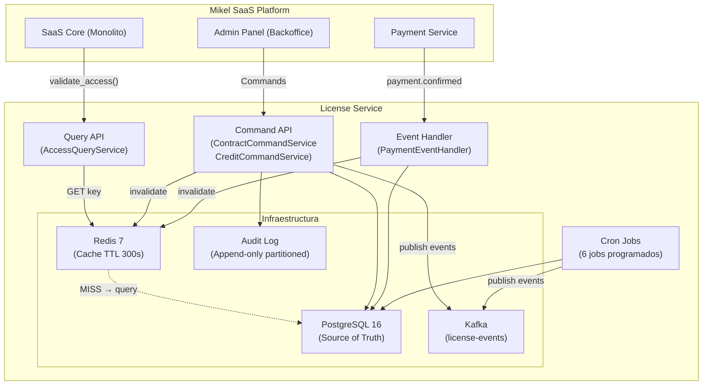
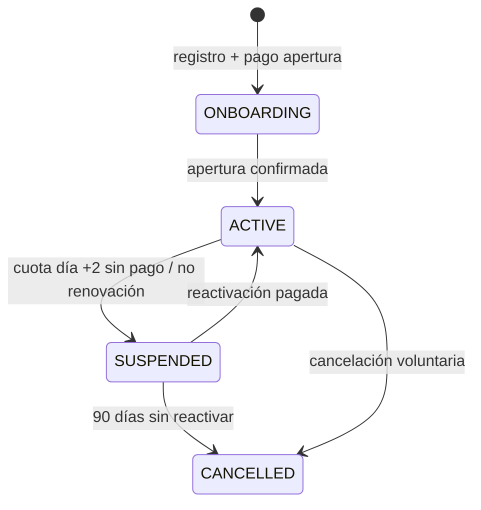
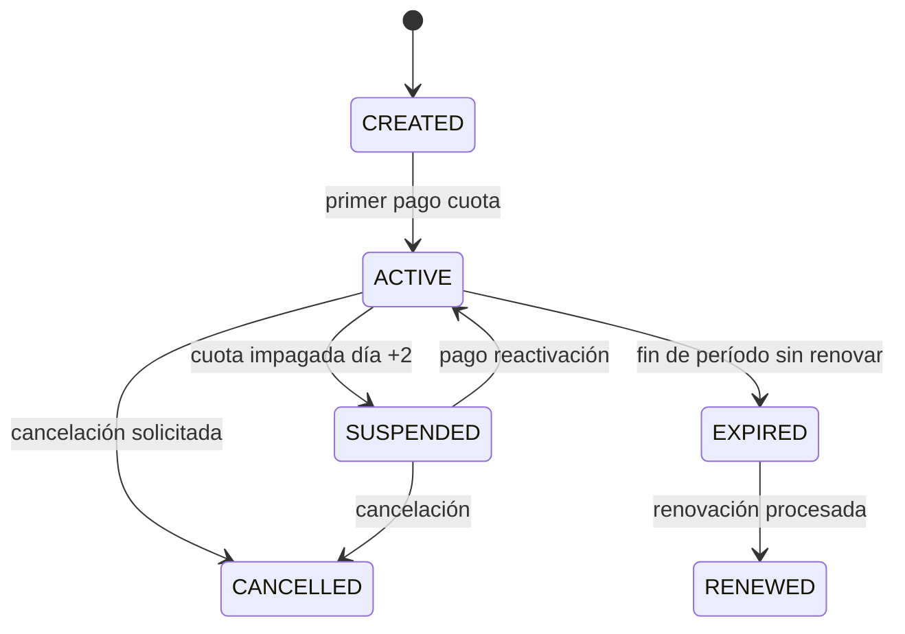
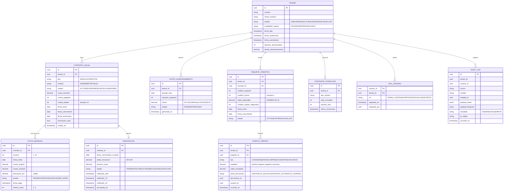

# Documento de Diseño Técnico — License Service Microservice

## Resumen (Overview)

El `license-service` es un microservicio independiente para la plataforma Mikel CRM que gestiona el ciclo de vida completo de licencias, contratos anuales, créditos, contadores de consultas, política de pagos y control de acceso basado en roles (RBAC) para todos los tenants del sistema SaaS.

### Problema

El control de acceso y la gestión de licencias se invoca en **cada acción** de cada usuario de cada Tenant. Implementarlo dentro del monolito principal generaría un cuello de botella de latencia, un punto único de fallo y una deuda de escalabilidad estructural.

### Solución

Microservicio independiente con arquitectura **CQRS + caché Redis** que separa el camino de escritura (ciclo de vida de contratos, cobros, reglas de negocio) del camino de lectura (validación ultrarrápida de acceso). El SaaS Core consulta únicamente el caché Redis; la base de datos relacional es la fuente de verdad y se actualiza de forma asíncrona.

### Stack Tecnológico

- **Lenguaje:** Java 21
- **Framework:** Spring Boot 3.x
- **Base de datos:** PostgreSQL 16 (fuente de verdad)
- **Caché:** Redis 7 (hot path de lectura)
- **Mensajería:** Kafka (topic `license-events`)
- **Migraciones:** Flyway
- **Autenticación:** JWT RS256 (TTL 15 min)

### Métricas Objetivo

| Métrica | Target |
|---------|--------|
| Latencia Query API (cache hit) | < 5 ms p99 |
| Latencia Command API | < 200 ms p99 |
| Cache hit rate | ≥ 95% |
| Disponibilidad | ≥ 99.9% mensual |
| Cobertura tests reglas de negocio | 100% de RN-* |

---

## Arquitectura

### Patrón CQRS — Separación de Responsabilidades

El servicio implementa CQRS (Command Query Responsibility Segregation) con dos caminos claramente diferenciados:

| Responsabilidad | Componente | Latencia | Persistencia |
|----------------|------------|----------|--------------|
| **Query** — validar acceso (hot path) | `AccessQueryService` | < 5 ms p99 | Redis cache |
| **Query** — leer estado de contrato/créditos | `ContractQueryService` | < 50 ms p99 | PostgreSQL read replica |
| **Command** — crear contrato, registrar pago, cambiar estado | `ContractCommandService` | < 200 ms p99 | PostgreSQL primary |
| **Command** — consumir crédito, cobrar excedente | `CreditCommandService` | < 100 ms p99 | PostgreSQL primary |
| **Event Handler** — reaccionar a eventos externos | `PaymentEventHandler` | Asíncrono | PostgreSQL + Redis invalidation |

### Diagrama de Componentes



### Estrategia de Caché Redis

**Estructura de la clave principal:**
```
tenant:{tenantId}:access
```

**Valor (JSON serializado):**
```json
{
  "tenantId": "uuid",
  "status": "ACTIVE | SUSPENDED | CANCELLED",
  "modules": ["ADMIN", "REPORTS", "TICKETS"],
  "creditBalance": 42,
  "roles": {
    "userId-1": "SUPERVISOR",
    "userId-2": "ASISTENTE"
  },
  "suspendedSince": null,
  "cachedAt": "ISO8601",
  "ttl": 300
}
```

**Políticas:**
- **TTL:** 300 segundos (5 minutos)
- **Invalidación forzada:** En cualquier Command que cambie el estado del Tenant
- **Warmup:** Al iniciar el servicio, pre-cargar Tenants ACTIVE con contratos próximos a vencer

**Flujo de validación (hot path):**
```
validate_access(tenantId, userId, module, action)
  → GET Redis key tenant:{tenantId}:access
      → HIT  → deserialize → evaluar permisos → return {allowed, role}   [~1 ms]
      → MISS → query PostgreSQL → write Redis → evaluar → return          [~30 ms]
```

### Máquina de Estados del Tenant



| Transición | Trigger | Side Effects |
|------------|---------|--------------|
| `ONBOARDING → ACTIVE` | `payment.apertura.confirmed` | Activar accesos; cargar créditos de bienvenida; publicar `tenant.activated` |
| `ACTIVE → SUSPENDED` | Cron / evento `cuota.overdue` | Bloquear acceso; generar `CuotaAlmacenamiento`; invalidar Redis; publicar `tenant.suspended` |
| `SUSPENDED → ACTIVE` | Command `ReactivarTenant` | Restaurar acceso; invalidar Redis; publicar `tenant.reactivated` |
| `ACTIVE → CANCELLED` | Command `CancelarTenant` | Retención 90 días; publicar `tenant.cancelled` |
| `SUSPENDED → CANCELLED` | Cron 90 días | Purge programado; publicar `tenant.cancelled` |

### Máquina de Estados del Contrato Anual



---

## Componentes e Interfaces

### Componentes del Servicio

| Componente | Responsabilidad | Dependencias |
|------------|----------------|--------------|
| `AccessQueryService` | Validación de acceso ultrarrápida via Redis | Redis, PostgreSQL (fallback) |
| `ContractQueryService` | Consulta de contratos, cuotas, resumen reactivación | PostgreSQL read replica |
| `ContractCommandService` | Crear/renovar/cancelar contratos, registrar pagos | PostgreSQL primary, Kafka, Redis |
| `CreditCommandService` | Consumir/adquirir créditos, bonus, excedente | PostgreSQL primary (SERIALIZABLE), Kafka |
| `PaymentEventHandler` | Consumir eventos de pago externos | Kafka consumer, PostgreSQL, Redis |
| `RBACMiddleware` | Evaluación de permisos por rol en cada request | Redis (cache matriz permisos) |
| `AuditService` | Registro inmutable de acciones (AOP) | PostgreSQL (tabla particionada) |
| `CronScheduler` | Orquestación de 6 jobs programados | Spring Scheduler, PostgreSQL, Kafka |

### Interfaces Externas

| Servicio Externo | Protocolo | Dirección | Datos Intercambiados |
|-----------------|-----------|-----------|---------------------|
| SaaS Core (Monolito) | HTTP REST | → Query API | `validate_access()` request/response |
| Admin Panel | HTTP REST | → Command API | Commands de gestión |
| Payment Service | Kafka events | ← Inbound | `payment.confirmed`, `payment.failed` |
| Notification Service | Kafka events | → Outbound | `tenant.suspended`, `credito.balance_low`, etc. |
| Auth Service | JWT validation | ← Inbound | Tokens RS256 con claims `tenantId`, `userId`, `rol` |

---

## Modelos de Datos

### Diagrama Entidad-Relación



### Campos Críticos y Restricciones de Integridad

| Tabla | Campo | Tipo | Restricción |
|-------|-------|------|-------------|
| `tenant` | `estado` | ENUM | Máquina de estados estricta — solo transiciones permitidas |
| `contrato_anual` | `cuotas_totales` | INT | Siempre 12; inmutable post-creación |
| `contrato_anual` | `cuota_mensual` | DECIMAL(10,2) | Fija durante 12 meses; inmutable |
| `cuota_mensual` | `descuento_pct` | DECIMAL | Solo 0, 3 o 10; calculado al momento del pago |
| `renovacion` | `tarifa_renovacion` | DECIMAL | Hardcoded 99.00 |
| `paquete_creditos` | `creditos_bonus` | INT | Siempre 4; automático en creación |
| `paquete_creditos` | `saldo_disponible` | NUMERIC(10,2) | `CHECK (saldo_disponible >= 0)` |
| `evento_credito` | `saldo_resultante` | NUMERIC(10,2) | `CHECK (saldo_resultante >= 0)` |
| `audit_log` | todos | — | Append-only; sin UPDATE ni DELETE; particionada por mes |

### Índices Críticos PostgreSQL

```sql
-- Hot path: validación de acceso
CREATE INDEX CONCURRENTLY idx_contrato_tenant_estado
  ON contrato_anual (tenant_id, estado)
  WHERE estado IN ('ACTIVE', 'SUSPENDED');

-- Cron jobs: cuotas vencidas
CREATE INDEX CONCURRENTLY idx_cuota_fecha_estado
  ON cuota_mensual (fecha_limite, estado)
  WHERE estado = 'PENDIENTE';

-- Cron jobs: renovaciones próximas
CREATE INDEX CONCURRENTLY idx_contrato_vencimiento_auto
  ON contrato_anual (fecha_vencimiento, renovacion_auto)
  WHERE estado = 'ACTIVE' AND renovacion_auto = true;

-- Contadores de consultas
CREATE INDEX CONCURRENTLY idx_contador_tenant_periodo
  ON contador_consultas (tenant_id, periodo_anio);

-- Audit log particionado por mes
CREATE TABLE audit_log_2026_06 PARTITION OF audit_log
  FOR VALUES FROM ('2026-06-01') TO ('2026-07-01');
```


---

## Especificación de API

### Convenciones Generales

- **Base URL:** `https://license.mikelcrm.internal/api/v1`
- **Autenticación:** JWT interno firmado por `auth-service` con claims `tenantId` y `userId`
- **Content-Type:** `application/json`
- **Commands:** Retornan `202 Accepted` + `correlationId`
- **Queries:** Retornan `200 OK` con payload o `404` si el recurso no existe

### Query API (Lectura — Hot Path)

#### `GET /access/{tenantId}`

Validación ultrarrápida de acceso. Consultado por el SaaS Core en cada acción de usuario.

**Response 200 (Tenant activo):**
```json
{
  "tenantId": "uuid",
  "status": "ACTIVE",
  "modules": ["ADMIN", "REPORTS", "TICKETS"],
  "creditBalance": 42.0,
  "userRole": "SUPERVISOR",
  "cachedAt": "2026-06-20T14:30:00Z"
}
```

**Response 403 (Tenant suspendido):**
```json
{
  "tenantId": "uuid",
  "status": "SUSPENDED",
  "suspendedSince": "2026-06-18",
  "adeudoTotal": 340.50,
  "reactivationUrl": "/api/v1/tenants/{id}/reactivation-summary"
}
```

#### `GET /tenants/{tenantId}/contracts`

Estado de todos los contratos anuales del Tenant.

**Response 200:**
```json
{
  "contracts": [
    {
      "contratoId": "uuid",
      "tipo": "MODULO",
      "modulo": "ADMIN",
      "estado": "ACTIVE",
      "cuotaMensual": 200.00,
      "cuotasPagadas": 5,
      "cuotasTotales": 12,
      "proximaFechaCobro": "2026-07-05",
      "fechaVencimientoContrato": "2027-01-05",
      "renovacionAuto": true,
      "descuentoDisponibleHoy": 10,
      "montoConDescuentoHoy": 180.00
    }
  ]
}
```

#### `GET /tenants/{tenantId}/credits`

Saldo, historial y contadores de consultas.

**Response 200:**
```json
{
  "saldoDisponible": 42.0,
  "creditosTotalesAdquiridos": 100,
  "umbralConsultasIncluidas": 10000,
  "contadorGlobalConsultas": 6540,
  "excedente": 0,
  "paqueteActivo": {
    "paqueteId": "uuid",
    "creditosPaquete": 100,
    "creditosBonus": 4,
    "fechaVencimiento": "2027-01-05"
  },
  "alertaNivel": null
}
```

#### `GET /tenants/{tenantId}/reactivation-summary`

Desglose del adeudo para reactivación.

**Response 200:**
```json
{
  "tenantId": "uuid",
  "diasEnMora": 12,
  "cuotasVencidas": [
    { "cuotaId": "uuid", "periodo": "2026-06", "monto": 200.00, "fechaLimite": "2026-06-05" }
  ],
  "cuotasAlmacenamiento": [
    { "periodo": "2026-06", "reportes": 247, "monto": 70.00 }
  ],
  "totalCuotasVencidas": 200.00,
  "totalAlmacenamiento": 70.00,
  "totalParaReactivar": 270.00
}
```

### Command API (Escritura)

#### `POST /tenants`

Registrar nuevo Tenant (inicio de onboarding).

**Request:**
```json
{
  "nombre": "Empresa S.A.",
  "emailContacto": "admin@empresa.com",
  "modalidadApertura": "ESTANDAR"
}
```

**Response 202:**
```json
{ "tenantId": "uuid", "correlationId": "uuid" }
```

#### `POST /tenants/{tenantId}/contracts`

Crear contrato anual para un módulo.

**Request:**
```json
{
  "tipo": "MODULO",
  "modulo": "ADMIN",
  "cuotaMensual": 200.00,
  "fechaInicio": "2026-07-01",
  "renovacionAuto": true
}
```

**Errores:**

| Código | Caso |
|--------|------|
| 409 | Ya existe contrato ACTIVE para ese módulo en el Tenant |
| 422 | Tenant CANCELLED o con adeudo pendiente |

#### `POST /tenants/{tenantId}/contracts/{contratoId}/cuotas/{cuotaId}/pay`

Registrar pago de cuota mensual. Aplica descuento por puntualidad.

**Request:**
```json
{
  "fechaPago": "2026-07-03",
  "metodoPago": "STRIPE_TOKEN",
  "referenciaExternal": "pi_xxx"
}
```

**Lógica de descuento:**
```java
public BigDecimal calcularMontoCobrado(Cuota cuota, LocalDate fechaPago) {
  LocalDate fechaLimite = cuota.getFechaLimite();
  if (fechaPago.isBefore(fechaLimite))
    return cuota.getMonto().multiply(new BigDecimal("0.90")); // 10% dto
  if (fechaPago.isEqual(fechaLimite))
    return cuota.getMonto().multiply(new BigDecimal("0.97")); // 3% dto
  if (fechaPago.isEqual(fechaLimite.plusDays(1)))
    return cuota.getMonto();                                   // día de gracia
  throw new CuotaVencidaException("Cuota en mora");
}
```

#### `POST /tenants/{tenantId}/contracts/{contratoId}/renew`

Procesar renovación anual.

**Request:**
```json
{ "metodoPago": "STRIPE_TOKEN" }
```

**Lógica:**
1. Validar contrato en Ventana de Renovación (días -30 a 0) o EXPIRED
2. Cobrar tarifa de renovación 99 €
3. Crear nuevo `ContratoAnual` con fechas +12 meses
4. Cobrar primera cuota del nuevo período (con descuento si aplica)
5. Publicar `contrato.renewed`

#### `POST /tenants/{tenantId}/credits/packages`

Adquirir paquete de créditos anuales.

**Request:**
```json
{ "cantidadCreditos": 100, "metodoPago": "STRIPE_TOKEN" }
```

**Lógica:**
```java
PaqueteCreditos paquete = new PaqueteCreditos();
paquete.setCreditosPaquete(request.getCantidadCreditos());
paquete.setCreditosBonus(4);  // Siempre 4, sin excepción
paquete.setSaldoDisponible(request.getCantidadCreditos() + 4);
paquete.setFechaVencimiento(LocalDate.now().plusYears(1));
```

#### `POST /tenants/{tenantId}/credits/consume`

Consumir créditos al generar un PDF. Implementa reserva atómica con transacción SERIALIZABLE.

**Request:**
```json
{
  "documentoId": "uuid",
  "usuarioId": "uuid",
  "perfilDocumento": "ASISTENCIA_DIGITAL"
}
```

**Perfiles y costos:**

| Perfil | Costo |
|--------|-------|
| `ASISTENCIA_DIGITAL` | 1.0 crédito |
| `ASISTENTE_AUTOMATICO_NORMAS` | 1.5 créditos |

**Lógica de reserva atómica:**
```java
@Transactional(isolation = SERIALIZABLE)
public void consumirCredito(UUID tenantId, ConsumoRequest req) {
  BigDecimal costo = COSTO_CREDITOS.get(req.getPerfilDocumento());
  PaqueteCreditos paquete = repo.findActiveByTenantForUpdate(tenantId);
  if (paquete.getSaldoDisponible().compareTo(costo) < 0)
    throw new SaldoInsuficienteException(paquete.getSaldoDisponible(), costo);
  paquete.setSaldoDisponible(paquete.getSaldoDisponible().subtract(costo));
  eventoRepo.save(new EventoCredito(tenantId, CONSUMO, costo.negate(),
    paquete.getSaldoDisponible(), req.getPerfilDocumento(),
    req.getDocumentoId(), req.getUsuarioId()));
}
```

**Compensación:** Si la generación del PDF falla, el importe reservado se reintegra en ≤ 30 segundos.

#### `POST /tenants/{tenantId}/reactivate`

Reactivar Tenant suspendido. Requiere pago total.

**Request:**
```json
{ "metodoPago": "STRIPE_TOKEN", "montoEsperado": 340.00 }
```

**Validación:**
```java
BigDecimal totalAdeudo = calcularTotalCuotasVencidas(tenantId)
    .add(calcularTotalAlmacenamientoAcumulado(tenantId));
if (request.getMontoEsperado().compareTo(totalAdeudo) != 0)
    throw new MontoIncorrectoException(totalAdeudo);
```

#### `DELETE /tenants/{tenantId}/contracts/{contratoId}`

Solicitar downgrade (no renovar al vencimiento).

**Validaciones:**
- Contrato en estado ACTIVE
- Sin cuotas vencidas pendientes
- Efectivo al vencimiento; acceso activo hasta fecha fin

#### `POST /tenants/{tenantId}/consultations`

Incrementar contador de consultas (+1).

**Request:**
```json
{ "tipoReporte": "INFORME_TECNICO", "documentoId": "uuid", "usuarioId": "uuid" }
```

**Lógica de excedente:**
```java
void procesarConsulta(UUID tenantId, String tipoReporte) {
  int globalActual = contadorRepo.incrementGlobal(tenantId);
  contadorRepo.incrementPorTipo(tenantId, tipoReporte);
  int umbral = creditoRepo.getUmbralConsultas(tenantId);
  int excedente = globalActual - umbral;
  if (excedente > 0 && excedente % 100 == 0) {
    creditCommandService.cobrarExcedenteConsultas(tenantId);
    eventoPublisher.publish(new ConsultaExcedenteEvent(tenantId, globalActual));
  }
}
```

---

## Domain Events

Todos los eventos se publican al topic Kafka `license-events`. Son inmutables y con schema versionado.

### Schema Base

```json
{
  "eventId": "uuid-v4",
  "eventType": "tenant.suspended",
  "version": "1.0",
  "tenantId": "uuid",
  "occurredAt": "2026-06-20T14:32:00Z",
  "payload": { },
  "metadata": {
    "correlationId": "uuid",
    "causationId": "uuid-del-command-origen",
    "service": "license-service",
    "environment": "prod"
  }
}
```

### Catálogo de Eventos

| Evento | Trigger | Payload Clave | Consumidores |
|--------|---------|---------------|--------------|
| `tenant.onboarded` | Apertura de contrato confirmada | `tenantId`, `modalidad`, `creditosBienvenida` | CRM Core, Notifications |
| `tenant.activated` | Primer pago exitoso | `tenantId`, `modulos` | CRM Core, Notifications, Redis |
| `tenant.suspended` | Cuota impagada día +2 | `tenantId`, `motivoSuspension`, `adeudoTotal` | CRM Core, Notifications, Redis |
| `tenant.reactivated` | Pago total reactivación | `tenantId`, `montoPagado` | CRM Core, Notifications, Redis |
| `tenant.cancelled` | Cancelación voluntaria o 90 días mora | `tenantId`, `fechaPurge` | CRM Core, Storage cleanup |
| `contrato.created` | Nuevo contrato anual activado | `contratoId`, `tenantId`, `modulo`, `cuotaMensual` | Billing, Notifications |
| `contrato.renewed` | Renovación anual procesada | `contratoId`, `nuevoContratoId`, `tarifaRenovacion` | Billing, Notifications |
| `contrato.expired` | Contrato vencido sin renovar | `contratoId`, `tenantId`, `modulo` | CRM Core, Redis |
| `cuota.charged` | Cuota mensual cobrada | `cuotaId`, `monto`, `descuentoPct`, `facturaId` | Billing, Notifications |
| `cuota.overdue` | Cuota día +2 sin pago | `cuotaId`, `contratoId`, `tenantId` | Cron → SuspenderTenant |
| `credito.consumed` | Créditos consumidos por PDF | `tenantId`, `documentoId`, `perfilDocumento`, `costo`, `saldoResultante` | Analytics |
| `credito.bonus_granted` | 4 créditos bonus otorgados | `tenantId`, `paqueteId`, `cantidad: 4` | Notifications |
| `credito.balance_low` | Saldo alcanza 20% / 10% / 0% | `tenantId`, `saldoActual`, `umbralAlcanzado` | Notifications |
| `consulta.excedente` | Contador global supera umbral | `tenantId`, `consultaNum`, `creditoCobrado` | Billing |
| `storage.fee_generated` | Cuota Almacenamiento generada | `tenantId`, `periodo`, `reportes`, `monto` | Billing, Notifications |
| `access.denied` | Acceso denegado por rol o estado | `tenantId`, `userId`, `recurso`, `motivo` | Audit, Security |

---

## Reglas de Negocio (Consolidadas)

### Contratos Anuales (RN-CONT)

| ID | Regla |
|----|-------|
| RN-CONT-01 | Todos los contratos son anuales con 12 cuotas mensuales. No existe modalidad mensual renovable |
| RN-CONT-02 | La cuota mensual es fija e inmutable durante los 12 meses del contrato |
| RN-CONT-03 | El upgrade genera un nuevo contrato independiente; no modifica contratos existentes |
| RN-CONT-04 | El downgrade solo se puede solicitar con contrato ACTIVE; efectivo al vencer el año; sin reembolso |
| RN-CONT-05 | No puede haber dos contratos ACTIVE para el mismo módulo en un Tenant |
| RN-CONT-06 | No se puede solicitar baja con cuotas vencidas pendientes |
| RN-CONT-07 | La suspensión por cuota impagada no extingue el contrato; las cuotas siguen exigibles |

### Pagos y Descuentos (RN-PAG)

| ID | Regla |
|----|-------|
| RN-PAG-01 | Pago antes de la Fecha Límite → descuento del 10% |
| RN-PAG-02 | Pago el mismo día de la Fecha Límite → descuento del 3% |
| RN-PAG-03 | Pago el día +1 (gracia) → precio normal sin descuento ni penalización |
| RN-PAG-04 | Día +2 sin pago → suspensión + Cuota de Almacenamiento |
| RN-PAG-05 | El descuento se refleja en la factura; el monto facturado es el descontado |
| RN-PAG-06 | Los descuentos no son acumulables entre sí ni con promociones |

### Renovación Anual (RN-REN)

| ID | Regla |
|----|-------|
| RN-REN-01 | Ventana de Renovación se abre día -30 del vencimiento |
| RN-REN-02 | Notificaciones en días -30, -7 y -1 con tarifa 99 € y opciones |
| RN-REN-03 | Renovación automática cobra: 99 € + primera cuota del nuevo período |
| RN-REN-04 | Si no se desactiva antes del día -1, el cobro se ejecuta en la Fecha de Vencimiento |
| RN-REN-05 | La tarifa de 99 € aplica por cada contrato; no se consolida |
| RN-REN-06 | Cobro de renovación fallido → Tenant SUSPENDED al día +1 |

### Suspensión y Almacenamiento (RN-SUS)

| ID | Regla |
|----|-------|
| RN-SUS-01 | Al suspender, acceso operativo bloqueado; consulta en solo lectura disponible |
| RN-SUS-02 | Fórmula Cuota Almacenamiento: `50 + CEIL(MAX(reportes - 100, 0) / 100) × 10` €/mes |
| RN-SUS-03 | Ejemplos: 0–100 rep = 50€; 101–200 = 60€; 201–300 = 70€; 301–400 = 80€ |
| RN-SUS-04 | Se genera el primer día de cada mes de suspensión activa |
| RN-SUS-05 | Las Cuotas de Almacenamiento acumuladas no caducan mientras la cuenta esté suspendida |
| RN-SUS-06 | Reactivación requiere pago total (100% adeudo); no se acepta pago parcial |
| RN-SUS-07 | Acceso restaurado en < 60 segundos tras pago confirmado |

### Créditos (RN-CRED)

| ID | Regla |
|----|-------|
| RN-CRED-01 | Costo por perfil: `ASISTENCIA_DIGITAL = 1.0`, `ASISTENTE_AUTOMATICO_NORMAS = 1.5` |
| RN-CRED-02 | Reserva atómica antes de generar PDF; reintegro en ≤ 30s si falla |
| RN-CRED-03 | Firmas, descargas, visualizaciones NO consumen crédito pero SÍ incrementan contador |
| RN-CRED-04 | Todo paquete anual otorga 4 créditos bonus automáticamente |
| RN-CRED-05 | Los créditos bonus se fusionan con el saldo; mismo vencimiento que el paquete |
| RN-CRED-06 | Créditos no consumidos al vencimiento caducan; no se transfieren |
| RN-CRED-07 | Bloqueo de envío si `saldo < costo_perfil`, con error informativo |
| RN-CRED-08 | Umbral consultas incluidas = `créditos_totales_adquiridos × 100` |
| RN-CRED-09 | Cada bloque de 100 consultas de excedente cobra 1 crédito |
| RN-CRED-10 | Saldo 0 + excedente: se registra deuda pero no se bloquean consultas |
| RN-CRED-11 | Saldo como `NUMERIC(10,2)` en PostgreSQL y `BigDecimal` en Java. Nunca float/double |

### Apertura de Contrato (RN-OPEN)

| ID | Regla |
|----|-------|
| RN-OPEN-01 | Todo Tenant nuevo debe pagar Apertura antes de acceder al CRM |
| RN-OPEN-02 | Apertura Estándar: 400€, 2 créditos bienvenida, reporte sin marca |
| RN-OPEN-03 | Apertura Personalizada: 1.400€, 10 créditos bienvenida, reporte con marca |
| RN-OPEN-04 | Créditos de bienvenida no caducan antes de 12 meses |
| RN-OPEN-05 | Upgrade Estándar → Personalizada: 1.000€ diferencia + 8 créditos adicionales |

### RBAC (Roles y Permisos)

| Rol | Permisos Principales | Restricciones |
|-----|---------------------|---------------|
| `ADMIN_CUENTA` | Gestión contratos, usuarios, licencias, créditos | Solo su propio Tenant |
| `SUPERVISOR` | Tablero, tickets, aprobación, eFirma | Solo módulo ADMIN activo |
| `TECNICO` | Enviar formas, generar PDF, consultar docs propios | Consume créditos según perfil |
| `ASISTENTE` | Leer/crear/actualizar clientes y tickets; consultar reportes | Sin acceso a aprobación, config, créditos |

---

## Jobs Programados (Cron)

| Job | Horario | Función | Lógica |
|-----|---------|---------|--------|
| `CuotaOverdueJob` | Diario 1:00 AM | Detectar cuotas Fecha Límite +2 sin pago | Publica `cuota.overdue` → dispara `SuspenderTenantCommand` |
| `RenovacionNotificacionJob` | Diario 8:00 AM | Alertas de renovación días -30, -7, -1 | Carga contratos donde `vencimiento - hoy ∈ {30, 7, 1}` |
| `RenovacionAutoJob` | Diario 9:00 AM | Renovación automática de contratos que vencen hoy | Solo `renovacion_auto = true`; cobro falla → `cuota.overdue` |
| `CuotaAlmacenamientoJob` | Día 1 cada mes, 2:00 AM | Generar Cuota Almacenamiento para Tenants SUSPENDED | Calcula reportes actuales; aplica fórmula; inserta cuota |
| `CreditosVencimientoJob` | Diario 3:00 AM | Caducar paquetes con `fecha_vencimiento = ayer` | Saldo a 0; publica `credito.expired` |
| `TenantCancelacionJob` | Diario 4:00 AM | Cancelar Tenants SUSPENDED ≥ 90 días | Verifica `fecha_suspension + 90 ≤ hoy`; publica `tenant.cancelled` |

### Estrategia de Procesamiento Batch

- **Batch size:** 500 registros por iteración
- **Paralelismo:** `@Async` con backoff exponencial para errores transitorios
- **Idempotencia:** Cada job valida el estado actual antes de procesar (evita doble suspensión)
- **SLA:** CuotaOverdueJob procesa hasta 10.000 contratos en < 5 minutos

---

## Seguridad

| Área | Implementación |
|------|----------------|
| **Autenticación** | JWT firmado RS256 por `auth-service`; TTL 15 min; `JwtAuthFilter` en Spring Security |
| **Autorización inter-servicios** | JWT de servicio con claim `service` (iss: `saas-core`) |
| **Confinamiento de Tenant** | `tenantId` del JWT validado contra el recurso en cada request; `@PreAuthorize("@tenantGuard.check(#tenantId, authentication)")` |
| **RBAC** | Evaluación de permisos (recurso, acción) contra matriz del rol; cache Redis TTL 5 min |
| **Audit Log** | AOP `@AuditAction` en todos los Commands; tabla append-only particionada |
| **Datos sensibles** | Nunca se almacenan datos de tarjeta; solo `referenciaExternal` del Payment Service |
| **Rate Limiting** | Query API: 1000 req/s por Tenant; Command API: 100 req/s por Tenant; Redis sliding window |
| **Deny explícito** | Permisos con `concedido = false` para recursos críticos (config, aprobación) tienen precedencia sobre allows |

---

## Rendimiento y Escalabilidad

| Escenario | Volumen Esperado | SLA | Estrategia |
|-----------|-----------------|-----|------------|
| Validación de acceso (Query hot path) | 500 req/s pico/instancia | < 5 ms p99 | Redis hit; escala horizontal stateless |
| Cache miss | < 5% de requests | < 30 ms p99 | PostgreSQL read replica indexada |
| Command de pago | 100 req/s pico | < 200 ms p99 | PostgreSQL primary + HikariCP |
| Cron CuotaOverdueJob | 10.000 contratos/día | < 5 min | Batch 500 + `@Async` |
| Cron RenovacionAutoJob | 2.000 renovaciones/día | < 10 min | Queue Kafka + 4 workers paralelos |
| Contadores de consultas | Async | ≤ 5 seg eventual | Kafka consumer group; Redis sorted set |

### Decisiones de Escalabilidad

1. **Horizontal Query API:** Stateless, detrás de load balancer; cada instancia lee Redis independientemente
2. **Connection Pool:** HikariCP con max 20 conexiones por instancia al PostgreSQL primary
3. **Redis Cluster:** Para alta disponibilidad; sentinels para failover automático
4. **Kafka Partitions:** Topic `license-events` con 8 particiones; consumer groups para paralelismo
5. **PostgreSQL Partitioning:** Audit Log particionado por mes; retención configurable


---

## Correctness Properties

*A property is a characteristic or behavior that should hold true across all valid executions of a system — essentially, a formal statement about what the system should do. Properties serve as the bridge between human-readable specifications and machine-verifiable correctness guarantees.*

### Property 1: Descuento por puntualidad es determinista según fecha relativa

*For any* cuota mensual con monto positivo (BigDecimal) y *for any* par (fechaPago, fechaLimite), el monto cobrado SHALL ser:
- `monto × 0.90` cuando `fechaPago < fechaLimite`
- `monto × 0.97` cuando `fechaPago == fechaLimite`
- `monto` cuando `fechaPago == fechaLimite + 1`
- Excepción `CuotaVencidaException` cuando `fechaPago > fechaLimite + 1`

**Validates: Requirements 3.1, 3.2, 3.3, 9.2**

### Property 2: Fórmula de Cuota de Almacenamiento

*For any* número entero no-negativo de `reportes_almacenados`, la Cuota de Almacenamiento SHALL ser exactamente `50 + CEIL(MAX(reportes - 100, 0) / 100) × 10` euros. Específicamente: para reportes ≤ 100 el resultado es 50, y el monto crece en escalones de 10€ por cada fracción de 100 reportes adicionales.

**Validates: Requirements 3.5**

### Property 3: Consumo de créditos por perfil de documento

*For any* Tenant con saldo suficiente y *for any* perfil de documento válido, el consumo de créditos SHALL descontar exactamente el costo configurado del perfil (`ASISTENCIA_DIGITAL = 1.0`, `ASISTENTE_AUTOMATICO_NORMAS = 1.5`) y el saldo resultante SHALL ser `saldo_antes - costo_perfil`.

**Validates: Requirements 5.1, 5.2**

### Property 4: Compensación de créditos es un round-trip

*For any* reserva de créditos seguida de un fallo en la generación del PDF, el saldo del Tenant SHALL ser igual al saldo anterior a la reserva (round-trip: reservar → fallar → compensar = estado original).

**Validates: Requirements 5.3**

### Property 5: Rechazo por saldo insuficiente

*For any* Tenant con saldo disponible y *for any* perfil de documento cuyo costo es mayor al saldo, el sistema SHALL rechazar la operación con HTTP 402 sin modificar el saldo. Formalmente: si `saldo < costo_perfil`, entonces `saldo_despues == saldo_antes` y la respuesta indica saldo actual y costo requerido.

**Validates: Requirements 5.4**

### Property 6: Adquisición de paquete otorga créditos + 4 bonus

*For any* cantidad N de créditos adquiridos (N > 0), el saldo resultante del Tenant SHALL incrementarse en exactamente `N + 4` (créditos del paquete + 4 bonus automáticos, sin excepción).

**Validates: Requirements 5.6**

### Property 7: Contadores de consultas son monotónicamente crecientes

*For any* secuencia de N consultas de cualquier combinación de tipos de reporte, el contador global SHALL ser igual a N y cada contador por tipo SHALL ser igual al número de consultas de ese tipo en la secuencia. Los contadores nunca decrementan dentro de un período.

**Validates: Requirements 6.3**

### Property 8: Cálculo de umbral y cobro de excedente por bloques de 100

*For any* Tenant con `creditos_totales_adquiridos` créditos, el umbral de consultas incluidas SHALL ser `creditos_totales × 100`. Y *for any* valor del contador global `G` que supere el umbral, los créditos cobrados por excedente SHALL ser exactamente `floor((G - umbral) / 100)` (solo bloques completos de 100).

**Validates: Requirements 6.4, 6.5, 6.6**

### Property 9: Máquina de estados solo permite transiciones válidas

*For any* estado actual del Tenant y *for any* transición intentada, la operación SHALL ser aceptada si y solo si la transición está en el conjunto de transiciones permitidas: {ONBOARDING→ACTIVE, ACTIVE→SUSPENDED, SUSPENDED→ACTIVE, ACTIVE→CANCELLED, SUSPENDED→CANCELLED}. Cualquier otra combinación SHALL ser rechazada con HTTP 422.

**Validates: Requirements 1.7**

### Property 10: Reactivación requiere monto exacto igual al adeudo total

*For any* Tenant en estado SUSPENDED con adeudo total calculado (suma de cuotas vencidas + cuotas de almacenamiento acumuladas), una solicitud de reactivación SHALL ser aceptada si y solo si el `montoEsperado` es numéricamente igual al adeudo total. Cualquier monto distinto (mayor o menor) SHALL ser rechazado.

**Validates: Requirements 1.4, 3.7, 9.4**

### Property 11: Unicidad de contrato activo por módulo

*For any* Tenant y *for any* módulo, no puede existir más de un Contrato Anual en estado ACTIVE simultáneamente para ese módulo. Intentar crear un segundo contrato ACTIVE para el mismo módulo SHALL resultar en HTTP 409.

**Validates: Requirements 2.5**

### Property 12: Inmutabilidad de cuota mensual durante vigencia del contrato

*For any* Contrato Anual creado con una cuota mensual C, el valor de la cuota SHALL permanecer igual a C durante toda la vigencia de las 12 cuotas del contrato. Ninguna operación puede modificar este valor post-creación.

**Validates: Requirements 2.4**

### Property 13: Evaluación RBAC es consistente con la matriz de permisos

*For any* combinación (rol, recurso, acción), la evaluación del middleware RBAC SHALL retornar `permitido` si y solo si la combinación está definida como `concedido = true` en la matriz de permisos. Un `deny explícito` (concedido = false) tiene precedencia sobre cualquier allow.

**Validates: Requirements 12.1, 12.2, 12.3**

### Property 14: Aislamiento de Tenant (confinamiento)

*For any* request con JWT conteniendo `tenantId = A` y un recurso perteneciente a `tenantId = B` donde `A ≠ B`, el sistema SHALL denegar el acceso con HTTP 403 independientemente del rol del usuario.

**Validates: Requirements 12.4, 15.2**

### Property 15: Módulo suspendido deniega acceso independientemente del rol

*For any* usuario con cualquier rol válido y *for any* módulo cuya licencia esté suspendida o inactiva, el acceso SHALL ser denegado con HTTP 403, incluso si el rol del usuario tiene permisos completos sobre ese módulo.

**Validates: Requirements 12.5**

### Property 16: Schema de Domain Events es completo y consistente

*For any* Domain Event publicado al topic Kafka, el JSON serializado SHALL contener todos los campos requeridos del schema base: `eventId` (UUID v4 válido), `eventType` (no vacío), `version`, `tenantId` (UUID válido), `occurredAt` (ISO8601 válido), `payload` (objeto), y `metadata` con `correlationId`, `causationId`, `service` y `environment`.

**Validates: Requirements 10.2**

### Property 17: Saldo de créditos nunca es negativo

*For any* secuencia de operaciones sobre el saldo de un Tenant (consumo, bonus, compra, caducidad, excedente), el valor de `saldo_disponible` SHALL ser siempre ≥ 0 en todo momento. La restricción CHECK de la base de datos y la validación en la capa de servicio garantizan este invariante.

**Validates: Requirements 14.2**

### Property 18: Alertas de saldo bajo se disparan en umbrales correctos

*For any* transición del saldo de un Tenant que cruza uno de los umbrales (20%, 10%, 0% del total adquirido), el sistema SHALL publicar exactamente un evento `credito.balance_low` con el `umbralAlcanzado` correcto. No se dispara si el saldo no cruza un umbral.

**Validates: Requirements 10.4**

### Property 19: Tarifa de renovación es independiente por contrato

*For any* Tenant con N contratos venciendo en la misma fecha (N ≥ 1), cada renovación automática SHALL cobrar la tarifa de 99€ individualmente, resultando en un total de `N × 99€` en tarifas de renovación. No se consolida ni aplica descuento por volumen.

**Validates: Requirements 4.4**

### Property 20: Invalidación de caché Redis en cada Command de estado

*For any* Command exitoso que modifique el estado de un Tenant (suspensión, reactivación, cambio de módulos, consumo de créditos, renovación), la clave Redis `tenant:{tenantId}:access` SHALL ser invalidada (eliminada) inmediatamente después de la operación, forzando un reload desde PostgreSQL en la siguiente consulta.

**Validates: Requirements 8.4**

---

## Manejo de Errores

### Códigos HTTP y Semántica

| Código | Semántica | Escenario |
|--------|-----------|-----------|
| 200 | Éxito (Queries) | Respuesta exitosa con datos |
| 202 | Aceptado (Commands) | Command recibido, procesando |
| 400 | Bad Request | Campos requeridos faltantes, formato inválido |
| 402 | Payment Required | Saldo insuficiente para consumo de créditos |
| 403 | Forbidden | Permiso denegado por RBAC o confinamiento de Tenant |
| 404 | Not Found | Recurso no existe |
| 409 | Conflict | Contrato duplicado para el mismo módulo |
| 422 | Unprocessable Entity | Transición de estado inválida, pago parcial, cuotas pendientes |
| 429 | Too Many Requests | Rate limiting excedido |
| 500 | Internal Server Error | Error inesperado del sistema |

### Estructura de Error Estándar

```json
{
  "error": "INSUFFICIENT_CREDITS",
  "message": "Saldo insuficiente. Saldo actual: 0.5, costo requerido: 1.5",
  "code": 402,
  "details": {
    "saldoActual": 0.5,
    "costoRequerido": 1.5,
    "perfilDocumento": "ASISTENTE_AUTOMATICO_NORMAS"
  },
  "correlationId": "uuid",
  "timestamp": "2026-06-20T14:32:00Z"
}
```

### Estrategia de Compensación

| Operación | Fallo Posible | Compensación | SLA |
|-----------|--------------|--------------|-----|
| Consumo de créditos | Generación PDF falla post-reserva | Reintegro automático del costo | ≤ 30 segundos |
| Renovación automática | Cobro falla | Publicar `cuota.overdue` → suspender al día +1 | Siguiente ejecución del cron |
| Publicación evento Kafka | Broker no disponible | Retry con backoff exponencial + dead letter queue | Máx 3 reintentos |

### Reintentos y Circuit Breaker

- **Redis:** Timeout 100ms; fallback a PostgreSQL en caso de fallo
- **Kafka:** Retry 3 veces con backoff exponencial (1s, 2s, 4s); dead letter topic
- **PostgreSQL:** HikariCP con validation timeout; health check cada 30s
- **Cobros (Payment Service):** Hasta 2 reintentos en días 0 y +1; día +2 → suspensión

---

## Estrategia de Testing

### Testing Dual: Unit + Property-Based

El `license-service` contiene lógica de negocio pura con propiedades universales (descuentos, fórmulas, máquina de estados, RBAC), lo que lo hace altamente adecuado para property-based testing.

**Framework de Property-Based Testing:** jqwik (Java) — integrado con JUnit 5

### Configuración de Property Tests

- **Iteraciones mínimas:** 100 por propiedad
- **Tag format:** `Feature: license-service-microservice, Property {N}: {título}`
- **Cada property test referencia explícitamente su propiedad del diseño**

### Distribución de Tests

| Tipo | Cobertura | Framework | Objetivo |
|------|-----------|-----------|----------|
| **Property tests** | 20 propiedades de correctness | jqwik + JUnit 5 | Validar invariantes universales con inputs generados |
| **Unit tests** | Reglas de negocio RN-*, edge cases, error paths | JUnit 5 + Mockito | Ejemplos específicos, condiciones de borde |
| **Integration tests** | Endpoints Command y Query, Redis, PostgreSQL | Spring Boot Test + Testcontainers | Flujos end-to-end con infraestructura real |
| **Contract tests** | Eventos Kafka (schema y payload) | Spring Cloud Contract | Compatibilidad con consumidores |
| **Load tests** | Escenarios de pico (sección Rendimiento) | k6 | Validar SLAs de latencia y throughput |
| **Security tests** | Cross-tenant, privilege escalation | OWASP ZAP + tests manuales | Validar confinamiento y RBAC |

### Mapeo Propiedades → Tests

| Propiedad | Tipo de Test | Generadores Necesarios |
|-----------|-------------|------------------------|
| P1: Descuento por puntualidad | Property (jqwik) | `BigDecimal` positivo, `LocalDate` pairs |
| P2: Fórmula almacenamiento | Property (jqwik) | `int` ≥ 0 (reportes) |
| P3: Consumo por perfil | Property (jqwik) | `BigDecimal` saldo, `PerfilDocumento` enum |
| P4: Compensación round-trip | Property (jqwik) | `BigDecimal` saldo, perfil, simulación de fallo |
| P5: Rechazo saldo insuficiente | Property (jqwik) | Pares (saldo, costo) donde saldo < costo |
| P6: Bonus de paquete | Property (jqwik) | `int` N > 0 (cantidad créditos) |
| P7: Contadores monotónicos | Property (jqwik) | Secuencias de `(tipoReporte, N)` |
| P8: Umbral y excedente | Property (jqwik) | `int` creditos_totales, `int` consultas |
| P9: Máquina de estados | Property (jqwik) | `(EstadoTenant, Transicion)` pares |
| P10: Monto exacto reactivación | Property (jqwik) | `BigDecimal` adeudo, `BigDecimal` montoOfrecido |
| P11: Unicidad contrato | Property (jqwik) | `UUID` tenant, `String` modulo |
| P12: Inmutabilidad cuota | Property (jqwik) | `ContratoAnual` con cuota fija |
| P13: RBAC matriz | Property (jqwik) | `(Rol, Recurso, Accion)` triples |
| P14: Aislamiento tenant | Property (jqwik) | Pares `(UUID tenantJwt, UUID tenantRecurso)` |
| P15: Módulo suspendido | Property (jqwik) | `(Rol, Modulo, estadoModulo)` triples |
| P16: Schema eventos | Property (jqwik) | Domain events con payloads aleatorios |
| P17: Saldo no-negativo | Property (jqwik) | Secuencias de operaciones de crédito |
| P18: Alertas umbral | Property (jqwik) | Transiciones de saldo cruzando umbrales |
| P19: Tarifa renovación | Property (jqwik) | `int` N contratos (1..10) |
| P20: Invalidación caché | Property (jqwik) | Commands aleatorios que cambian estado |

### Unit Tests (Complementarios)

Los unit tests cubren:
- **Ejemplos concretos** de reglas de negocio (TC-CONT-01 a TC-SUS-07)
- **Edge cases** específicos: saldo exactamente igual al costo, fecha límite en fin de mes, 90 días exactos de suspensión
- **Error paths:** Tenant cancelado intentando crear contrato, payload malformado
- **Integraciones:** Verificar que los eventos Kafka se publican con schema correcto
