# Documento de Diseño Técnico — Portal de Contratación Frontend

## Resumen (Overview)

### Problema

Los prospectos del CRM Mikel necesitan una herramienta visual e interactiva para explorar la oferta de módulos, calcular precios en tiempo real y solicitar contratos sin intervención humana. A su vez, los tenants activos necesitan un panel que centralice la información de su contrato, créditos, cuotas y alertas en un solo lugar.

### Solución

Aplicación Angular 18 SPA (Single Page Application) con dos experiencias diferenciadas:

1. **Portal público** (`/contratacion`): Calculadora interactiva de módulos y precios, generación de resumen y flujo de solicitud de contrato. No requiere autenticación.
2. **Dashboard autenticado** (`/dashboard`): Panel de gestión para tenants con roles ADMIN_CUENTA o SUPERVISOR. Consume la Query API del `license-service` existente.

### Stack Tecnológico

| Capa | Tecnología | Justificación |
|------|-----------|---------------|
| Framework | Angular 18 (standalone components, signals) | Última versión estable con reactividad nativa |
| Lenguaje | TypeScript 5.x | Tipado estricto end-to-end |
| UI Components | Angular Material 18 | Ecosistema oficial Angular, accesibilidad WCAG AA |
| Estilos | TailwindCSS 3.x | Responsive utilities, breakpoints flexibles |
| Estado | Angular Signals | Estado reactivo sin librerías externas |
| HTTP | Angular HttpClient + interceptores | Integración nativa, interceptores para JWT |
| Routing | Angular Router (lazy loading) | Carga bajo demanda por feature |
| Auth | JWT con HttpInterceptor | Inyección automática de token en requests |
| Testing | Jasmine + Karma (unit), fast-check (PBT) | PBT para lógica de calculadora y roles |

---

## Arquitectura

### Estructura de Módulos (Lazy-Loaded Features)

```mermaid
graph TB
    subgraph "App Shell"
        AppComponent["AppComponent (standalone)"]
        Router["Angular Router"]
    end

    subgraph "Feature: Portal Público"
        PublicLayout["PublicLayoutComponent"]
        ModuleCards["ModuleCardsComponent"]
        Calculator["CalculatorComponent"]
        CreditPackages["CreditPackagesComponent"]
        DiscountPolicy["DiscountPolicyComponent"]
        ServiceSummary["ServiceSummaryComponent"]
        ContractRequest["ContractRequestComponent"]
    end

    subgraph "Feature: Dashboard"
        DashLayout["DashboardLayoutComponent"]
        ContractSection["ContractSectionComponent"]
        ModulesSection["ModulesSectionComponent"]
        CreditsSection["CreditsSectionComponent"]
        QuotaSection["QuotaSectionComponent"]
        HistoryTable["HistoryTableComponent"]
        ActionButtons["ActionButtonsComponent"]
        BannerPromo["BannerPromoComponent"]
    end

    subgraph "Shared / Core"
        AuthInterceptor["AuthInterceptor (HttpInterceptorFn)"]
        AuthGuard["authGuard (CanActivateFn)"]
        RoleGuard["roleGuard (CanActivateFn)"]
        LicenseService["LicenseApiService"]
        AuthService["AuthService"]
        ErrorHandler["ErrorHandlerComponent"]
        LoadingSkeleton["LoadingSkeletonComponent"]
    end

    AppComponent --> Router
    Router -->|"/contratacion (lazy)"| PublicLayout
    Router -->|"/dashboard (lazy)"| DashLayout

    PublicLayout --> ModuleCards
    PublicLayout --> Calculator
    PublicLayout --> CreditPackages
    PublicLayout --> DiscountPolicy
    PublicLayout --> ServiceSummary
    PublicLayout --> ContractRequest

    DashLayout --> ContractSection
    DashLayout --> ModulesSection
    DashLayout --> CreditsSection
    DashLayout --> QuotaSection
    DashLayout --> HistoryTable
    DashLayout --> ActionButtons
    DashLayout --> BannerPromo

    DashLayout --> AuthInterceptor
    DashLayout --> AuthGuard
    DashLayout --> RoleGuard
    DashLayout --> LicenseService
```



### Estructura de Carpetas

```
src/
├── app/
│   ├── app.component.ts          # Shell standalone
│   ├── app.config.ts             # provideRouter, provideHttpClient
│   ├── app.routes.ts             # Rutas raíz con lazy loading
│   │
│   ├── core/                     # Servicios singleton, interceptores, guards
│   │   ├── services/
│   │   │   ├── license-api.service.ts
│   │   │   └── auth.service.ts
│   │   ├── interceptors/
│   │   │   └── auth.interceptor.ts
│   │   ├── guards/
│   │   │   ├── auth.guard.ts
│   │   │   └── role.guard.ts
│   │   └── models/
│   │       ├── api-responses.model.ts
│   │       ├── calculator.model.ts
│   │       └── auth.model.ts
│   │
│   ├── features/
│   │   ├── public-portal/        # Lazy-loaded feature
│   │   │   ├── public-portal.routes.ts
│   │   │   ├── layout/
│   │   │   │   └── public-layout.component.ts
│   │   │   ├── components/
│   │   │   │   ├── module-cards/
│   │   │   │   ├── calculator/
│   │   │   │   ├── credit-packages/
│   │   │   │   ├── discount-policy/
│   │   │   │   ├── service-summary/
│   │   │   │   └── contract-request/
│   │   │   └── services/
│   │   │       └── calculator.service.ts
│   │   │
│   │   └── dashboard/            # Lazy-loaded feature
│   │       ├── dashboard.routes.ts
│   │       ├── layout/
│   │       │   └── dashboard-layout.component.ts
│   │       ├── components/
│   │       │   ├── contract-section/
│   │       │   ├── modules-section/
│   │       │   ├── credits-section/
│   │       │   ├── quota-section/
│   │       │   ├── history-table/
│   │       │   ├── action-buttons/
│   │       │   └── banner-promo/
│   │       └── services/
│   │           └── dashboard.service.ts
│   │
│   └── shared/                   # Componentes reutilizables
│       ├── components/
│       │   ├── loading-skeleton/
│       │   ├── error-handler/
│       │   └── progress-bar/
│       └── pipes/
│           ├── currency-eur.pipe.ts
│           └── date-es.pipe.ts
│
├── environments/
│   ├── environment.ts
│   └── environment.prod.ts
│
└── assets/
    └── i18n/
```

### Configuración de Rutas (Lazy Loading)

```typescript
// app.routes.ts
import { Routes } from '@angular/router';
import { authGuard } from './core/guards/auth.guard';
import { roleGuard } from './core/guards/role.guard';

export const routes: Routes = [
  {
    path: 'contratacion',
    loadChildren: () =>
      import('./features/public-portal/public-portal.routes')
        .then(m => m.PUBLIC_PORTAL_ROUTES),
  },
  {
    path: 'dashboard',
    canActivate: [authGuard, roleGuard],
    data: { roles: ['ADMIN_CUENTA', 'SUPERVISOR'] },
    loadChildren: () =>
      import('./features/dashboard/dashboard.routes')
        .then(m => m.DASHBOARD_ROUTES),
  },
  { path: '', redirectTo: 'contratacion', pathMatch: 'full' },
  { path: 'acceso-denegado', loadComponent: () =>
      import('./shared/components/access-denied/access-denied.component')
        .then(c => c.AccessDeniedComponent) },
  { path: '**', redirectTo: 'contratacion' },
];
```

### Estrategia de Lazy Loading

| Bundle | Ruta | Tamaño Estimado | Motivo |
|--------|------|-----------------|--------|
| `public-portal` | `/contratacion` | ~80 KB | Componentes de calculadora, tarjetas, resumen |
| `dashboard` | `/dashboard` | ~120 KB | Secciones del panel, gráficos, tablas |
| `shared` | Eager (app shell) | ~30 KB | Pipes, skeleton, error handler |

---

## Componentes e Interfaces

### Portal Público — Componentes Clave

#### `ModuleCardsComponent`

```typescript
@Component({
  selector: 'app-module-cards',
  standalone: true,
  imports: [CommonModule, MatCardModule, MatCheckboxModule],
  changeDetection: ChangeDetectionStrategy.OnPush,
})
export class ModuleCardsComponent {
  modules = input.required<ModuloDisponible[]>();
  selectionChanged = output<ModuloDisponible[]>();

  selectedModules = signal<Set<string>>(new Set(['CRM_BASE']));

  toggleModule(moduleId: string): void {
    if (moduleId === 'CRM_BASE') return; // No desmarcable
    this.selectedModules.update(set => {
      const next = new Set(set);
      next.has(moduleId) ? next.delete(moduleId) : next.add(moduleId);
      return next;
    });
    this.emitSelection();
  }

  isSelected(moduleId: string): boolean {
    return this.selectedModules().has(moduleId);
  }

  private emitSelection(): void {
    const selected = this.modules()
      .filter(m => this.selectedModules().has(m.id));
    this.selectionChanged.emit(selected);
  }
}
```

#### `CalculatorComponent` (Signal-based)

```typescript
@Component({
  selector: 'app-calculator',
  standalone: true,
  changeDetection: ChangeDetectionStrategy.OnPush,
})
export class CalculatorComponent {
  private calculatorService = inject(CalculatorService);

  selectedModules = input.required<ModuloDisponible[]>();
  selectedPackage = input<PaqueteCreditos | null>();

  // Computed signals derivados
  subtotales = computed(() =>
    this.calculatorService.calcularSubtotales(this.selectedModules())
  );
  totalAnual = computed(() =>
    this.calculatorService.calcularTotalAnual(
      this.selectedModules(),
      this.selectedPackage()
    )
  );
  cuotaMensual = computed(() =>
    this.calculatorService.calcularCuotaMensual(this.totalAnual())
  );
}
```

#### `CalculatorService` (Lógica pura — testeable con PBT)

```typescript
@Injectable({ providedIn: 'root' })
export class CalculatorService {

  calcularSubtotales(modules: ModuloDisponible[]): SubtotalItem[] {
    return modules.map(m => ({
      moduloId: m.id,
      nombre: m.nombre,
      precioMensual: m.precioMensual,
      subtotalAnual: m.precioMensual * 12,
    }));
  }

  calcularTotalAnual(
    modules: ModuloDisponible[],
    paquete: PaqueteCreditos | null
  ): number {
    const totalModulos = modules.reduce(
      (sum, m) => sum + m.precioMensual * 12, 0
    );
    const totalPaquete = paquete?.precioAnual ?? 0;
    return totalModulos + totalPaquete;
  }

  calcularCuotaMensual(totalAnual: number): number {
    return totalAnual / 12;
  }

  calcularDescuento(
    monto: number,
    fechaPago: Date,
    fechaLimite: Date
  ): { porcentaje: number; montoFinal: number } {
    const pago = fechaPago.getTime();
    const limite = fechaLimite.getTime();

    if (pago < limite) {
      return { porcentaje: 10, montoFinal: monto * 0.90 };
    }
    if (pago === limite) {
      return { porcentaje: 3, montoFinal: monto * 0.97 };
    }
    return { porcentaje: 0, montoFinal: monto };
  }
}
```

### Dashboard — Componentes Clave

#### `CreditsSectionComponent`

```typescript
@Component({
  selector: 'app-credits-section',
  standalone: true,
  changeDetection: ChangeDetectionStrategy.OnPush,
})
export class CreditsSectionComponent {
  creditData = input.required<CreditResponse | null>();
  loading = input<boolean>(false);
  error = input<string | null>(null);

  consumoAcumulado = computed(() => {
    const data = this.creditData();
    if (!data) return 0;
    return data.creditosTotalesAdquiridos - data.saldoDisponible;
  });

  porcentajeConsumo = computed(() => {
    const data = this.creditData();
    if (!data || data.creditosTotalesAdquiridos === 0) return 0;
    return (this.consumoAcumulado() / data.creditosTotalesAdquiridos) * 100;
  });

  colorBarra = computed((): 'green' | 'yellow' | 'red' => {
    const pct = this.porcentajeConsumo();
    if (pct <= 80) return 'green';
    if (pct <= 95) return 'yellow';
    return 'red';
  });
}
```

#### `BannerPromoComponent`

```typescript
@Component({
  selector: 'app-banner-promo',
  standalone: true,
  changeDetection: ChangeDetectionStrategy.OnPush,
})
export class BannerPromoComponent {
  contractData = input.required<ContractResponse | null>();
  creditData = input.required<CreditResponse | null>();

  dismissedBanners = signal<Set<string>>(new Set());

  showRenovacion = computed(() => {
    const contract = this.contractData();
    if (!contract || this.dismissedBanners().has('renovacion')) return false;
    const primaryContract = contract.contracts[0];
    if (!primaryContract) return false;
    const vencimiento = new Date(primaryContract.fechaVencimientoContrato);
    const hoy = new Date();
    const diasRestantes = Math.ceil(
      (vencimiento.getTime() - hoy.getTime()) / (1000 * 60 * 60 * 24)
    );
    return diasRestantes <= 30 && diasRestantes > 0;
  });

  showCreditosBaratos = computed(() => {
    const credits = this.creditData();
    if (!credits || this.dismissedBanners().has('creditos')) return false;
    const total = credits.creditosTotalesAdquiridos;
    return total > 0 && credits.saldoDisponible <= total * 0.05;
  });

  dismiss(bannerId: string): void {
    this.dismissedBanners.update(set => new Set([...set, bannerId]));
  }
}
```

---

## Modelos de Datos

### Interfaces TypeScript — Respuestas de API

```typescript
// core/models/api-responses.model.ts

export interface AccessResponse {
  tenantId: string;
  status: 'ACTIVE' | 'SUSPENDED' | 'CANCELLED' | 'ONBOARDING';
  modules: string[];
  creditBalance: number;
  userRole: 'ADMIN_CUENTA' | 'SUPERVISOR' | 'TECNICO' | 'ASISTENTE';
  cachedAt: string; // ISO 8601
}

export interface ContractResponse {
  contracts: ContractDetail[];
}

export interface ContractDetail {
  contratoId: string;
  tipo: 'MODULO' | 'CREDITOS';
  modulo: string | null;
  estado: 'ACTIVE' | 'SUSPENDED' | 'CANCELLED' | 'EXPIRED';
  cuotaMensual: number;
  cuotasPagadas: number;
  cuotasTotales: number; // siempre 12
  proximaFechaCobro: string; // ISO date
  fechaVencimientoContrato: string; // ISO date
  renovacionAuto: boolean;
  descuentoDisponibleHoy: number; // 10, 3 o 0
  montoConDescuentoHoy: number;
}

export interface CreditResponse {
  saldoDisponible: number;
  creditosTotalesAdquiridos: number;
  umbralConsultasIncluidas: number;
  contadorGlobalConsultas: number;
  excedente: number;
  paqueteActivo: PaqueteActivo | null;
  alertaNivel: string | null;
}

export interface PaqueteActivo {
  paqueteId: string;
  creditosPaquete: number;
  creditosBonus: number;
  fechaVencimiento: string; // ISO date
}

export interface ReactivationSummaryResponse {
  tenantId: string;
  diasEnMora: number;
  cuotasVencidas: CuotaVencidaDetail[];
  cuotasAlmacenamiento: CuotaAlmacenamientoDetail[];
  totalCuotasVencidas: number;
  totalAlmacenamiento: number;
  totalParaReactivar: number;
}

export interface CuotaVencidaDetail {
  cuotaId: string;
  periodo: string;
  monto: number;
  fechaLimite: string; // ISO date
}

export interface CuotaAlmacenamientoDetail {
  periodo: string;
  reportes: number;
  monto: number;
}
```

### Interfaces — Estado del Portal Público (Calculadora)

```typescript
// core/models/calculator.model.ts

export interface ModuloDisponible {
  id: string;
  nombre: string;
  descripcion: string;
  precioMensual: number;
  obligatorio: boolean; // true solo para CRM_BASE
}

export interface PaqueteCreditos {
  id: string;
  nombre: string;
  creditos: number;
  bonus: number; // siempre 4
  precioAnual: number;
}

export interface SubtotalItem {
  moduloId: string;
  nombre: string;
  precioMensual: number;
  subtotalAnual: number;
}

export interface CalculadoraState {
  modulosSeleccionados: ModuloDisponible[];
  paqueteSeleccionado: PaqueteCreditos | null;
  subtotales: SubtotalItem[];
  totalAnual: number;
  cuotaMensual: number;
}

export interface ResumenServicios {
  modulos: SubtotalItem[];
  paqueteCreditos: PaqueteCreditos | null;
  totalAnual: number;
  cuotaMensual: number;
  politicaDescuentos: string;
  fechaGeneracion: Date;
}
```

### Interfaces — Estado de Autenticación

```typescript
// core/models/auth.model.ts

export interface JwtPayload {
  sub: string;        // userId
  tenantId: string;
  rol: 'ADMIN_CUENTA' | 'SUPERVISOR' | 'TECNICO' | 'ASISTENTE';
  exp: number;        // UNIX timestamp
  iat: number;
}

export interface AuthState {
  isAuthenticated: boolean;
  token: string | null;
  user: JwtPayload | null;
  tenantId: string | null;
}

export type UserRole = 'ADMIN_CUENTA' | 'SUPERVISOR' | 'TECNICO' | 'ASISTENTE';
```

### Datos Estáticos — Catálogo de Módulos

```typescript
// Configuración estática de módulos disponibles
export const MODULOS_DISPONIBLES: ModuloDisponible[] = [
  { id: 'CRM_BASE', nombre: 'CRM Base', descripcion: 'Gestión de clientes y contactos', precioMensual: 200, obligatorio: true },
  { id: 'REPORTES', nombre: 'Reportes', descripcion: 'Generación de informes técnicos', precioMensual: 150, obligatorio: false },
  { id: 'TICKETS', nombre: 'Tickets', descripcion: 'Sistema de soporte y seguimiento', precioMensual: 100, obligatorio: false },
  { id: 'ADMIN', nombre: 'Administrador', descripcion: 'Panel de administración avanzada', precioMensual: 250, obligatorio: false },
];

export const PAQUETES_CREDITOS: PaqueteCreditos[] = [
  { id: 'PKG_100', nombre: 'Paquete 100', creditos: 100, bonus: 4, precioAnual: 500 },
  { id: 'PKG_500', nombre: 'Paquete 500', creditos: 500, bonus: 4, precioAnual: 2000 },
];
```


---

## Integración con API

### `LicenseApiService`

```typescript
// core/services/license-api.service.ts
import { Injectable, inject } from '@angular/core';
import { HttpClient } from '@angular/common/http';
import { Observable, retry, timeout, catchError, of } from 'rxjs';
import { environment } from '../../../environments/environment';

@Injectable({ providedIn: 'root' })
export class LicenseApiService {
  private readonly http = inject(HttpClient);
  private readonly baseUrl = `${environment.apiUrl}/api/v1`;

  private readonly DEFAULT_TIMEOUT = 10_000; // 10 segundos
  private readonly RETRY_COUNT = 1;

  getAccess(tenantId: string): Observable<AccessResponse> {
    return this.http.get<AccessResponse>(
      `${this.baseUrl}/access/${tenantId}`
    ).pipe(
      timeout(this.DEFAULT_TIMEOUT),
      retry(this.RETRY_COUNT),
    );
  }

  getContracts(tenantId: string): Observable<ContractResponse> {
    return this.http.get<ContractResponse>(
      `${this.baseUrl}/tenants/${tenantId}/contracts`
    ).pipe(
      timeout(this.DEFAULT_TIMEOUT),
      retry(this.RETRY_COUNT),
    );
  }

  getCredits(tenantId: string): Observable<CreditResponse> {
    return this.http.get<CreditResponse>(
      `${this.baseUrl}/tenants/${tenantId}/credits`
    ).pipe(
      timeout(this.DEFAULT_TIMEOUT),
      retry(this.RETRY_COUNT),
    );
  }

  getReactivationSummary(tenantId: string): Observable<ReactivationSummaryResponse> {
    return this.http.get<ReactivationSummaryResponse>(
      `${this.baseUrl}/tenants/${tenantId}/reactivation-summary`
    ).pipe(
      timeout(this.DEFAULT_TIMEOUT),
      retry(this.RETRY_COUNT),
    );
  }
}
```

### HTTP Interceptor para JWT

```typescript
// core/interceptors/auth.interceptor.ts
import { HttpInterceptorFn } from '@angular/common/http';
import { inject } from '@angular/core';
import { AuthService } from '../services/auth.service';

export const authInterceptor: HttpInterceptorFn = (req, next) => {
  const authService = inject(AuthService);
  const token = authService.getToken();

  if (token && req.url.includes('/api/')) {
    const cloned = req.clone({
      setHeaders: { Authorization: `Bearer ${token}` },
    });
    return next(cloned);
  }

  return next(req);
};
```

### Configuración de Providers

```typescript
// app.config.ts
import { ApplicationConfig } from '@angular/core';
import { provideRouter, withComponentInputBinding } from '@angular/router';
import { provideHttpClient, withInterceptors } from '@angular/common/http';
import { provideAnimationsAsync } from '@angular/platform-browser/animations/async';
import { routes } from './app.routes';
import { authInterceptor } from './core/interceptors/auth.interceptor';

export const appConfig: ApplicationConfig = {
  providers: [
    provideRouter(routes, withComponentInputBinding()),
    provideHttpClient(withInterceptors([authInterceptor])),
    provideAnimationsAsync(),
  ],
};
```

---

## Gestión de Estado (Signals)

### Portal Público — Estado de la Calculadora

El estado de la calculadora se gestiona completamente con Angular Signals, sin necesidad de librerías externas como NgRx. La lógica es local al feature `public-portal`:

```typescript
// features/public-portal/services/calculator-state.service.ts
@Injectable()
export class CalculatorStateService {
  // Estado mutable
  private readonly _selectedModules = signal<ModuloDisponible[]>(
    MODULOS_DISPONIBLES.filter(m => m.obligatorio)
  );
  private readonly _selectedPackage = signal<PaqueteCreditos | null>(null);

  // Estado público (readonly)
  readonly selectedModules = this._selectedModules.asReadonly();
  readonly selectedPackage = this._selectedPackage.asReadonly();

  // Computed derivados
  private readonly calculatorService = inject(CalculatorService);

  readonly subtotales = computed(() =>
    this.calculatorService.calcularSubtotales(this._selectedModules())
  );
  readonly totalAnual = computed(() =>
    this.calculatorService.calcularTotalAnual(
      this._selectedModules(), this._selectedPackage()
    )
  );
  readonly cuotaMensual = computed(() =>
    this.calculatorService.calcularCuotaMensual(this.totalAnual())
  );

  // Mutaciones
  toggleModule(module: ModuloDisponible): void {
    if (module.obligatorio) return;
    this._selectedModules.update(modules => {
      const exists = modules.find(m => m.id === module.id);
      return exists
        ? modules.filter(m => m.id !== module.id)
        : [...modules, module];
    });
  }

  selectPackage(pkg: PaqueteCreditos | null): void {
    this._selectedPackage.set(pkg);
  }

  reset(): void {
    this._selectedModules.set(
      MODULOS_DISPONIBLES.filter(m => m.obligatorio)
    );
    this._selectedPackage.set(null);
  }
}
```

### Dashboard — Estado con Signals + API

```typescript
// features/dashboard/services/dashboard-state.service.ts
@Injectable()
export class DashboardStateService {
  private readonly licenseApi = inject(LicenseApiService);
  private readonly authService = inject(AuthService);

  // Estado de carga por sección
  readonly contractLoading = signal(false);
  readonly creditsLoading = signal(false);

  // Estado de error por sección
  readonly contractError = signal<string | null>(null);
  readonly creditsError = signal<string | null>(null);

  // Datos cargados
  readonly contractData = signal<ContractResponse | null>(null);
  readonly creditData = signal<CreditResponse | null>(null);
  readonly accessData = signal<AccessResponse | null>(null);

  loadAllSections(): void {
    const tenantId = this.authService.getTenantId();
    if (!tenantId) return;

    this.loadContracts(tenantId);
    this.loadCredits(tenantId);
    this.loadAccess(tenantId);
  }

  private loadContracts(tenantId: string): void {
    this.contractLoading.set(true);
    this.contractError.set(null);
    this.licenseApi.getContracts(tenantId).subscribe({
      next: (data) => {
        this.contractData.set(data);
        this.contractLoading.set(false);
      },
      error: (err) => {
        this.contractError.set(this.mapError(err));
        this.contractLoading.set(false);
      },
    });
  }

  private loadCredits(tenantId: string): void {
    this.creditsLoading.set(true);
    this.creditsError.set(null);
    this.licenseApi.getCredits(tenantId).subscribe({
      next: (data) => {
        this.creditData.set(data);
        this.creditsLoading.set(false);
      },
      error: (err) => {
        this.creditsError.set(this.mapError(err));
        this.creditsLoading.set(false);
      },
    });
  }

  private loadAccess(tenantId: string): void {
    this.licenseApi.getAccess(tenantId).subscribe({
      next: (data) => this.accessData.set(data),
      error: () => {}, // Access errors handled by guards
    });
  }

  retrySection(section: 'contracts' | 'credits'): void {
    const tenantId = this.authService.getTenantId();
    if (!tenantId) return;
    if (section === 'contracts') this.loadContracts(tenantId);
    if (section === 'credits') this.loadCredits(tenantId);
  }

  private mapError(err: unknown): string {
    if (err instanceof TimeoutError) return 'TIMEOUT';
    if (err instanceof HttpErrorResponse && err.status >= 500) return 'SERVER_ERROR';
    return 'UNKNOWN_ERROR';
  }
}
```

---

## Diseño UI/UX

### Wireframe — Portal Público (`/contratacion`)

```
┌─────────────────────────────────────────────────────────────┐
│  HEADER: Logo Mikel CRM | "Portal de Contratación"  | Login│
├─────────────────────────────────────────────────────────────┤
│                                                             │
│  ┌── Módulos Disponibles ──────────────────────────────┐   │
│  │  [✓ CRM Base 200€/mes]  [☐ Reportes 150€/mes]     │   │
│  │  [☐ Tickets 100€/mes]   [☐ Admin 250€/mes]        │   │
│  └─────────────────────────────────────────────────────┘   │
│                                                             │
│  ┌── Complementos Opcionales ──────────────────────────┐   │
│  │  (○) Paquete 100 créditos + 4 bonus — 500€/año     │   │
│  │  (○) Paquete 500 créditos + 4 bonus — 2.000€/año   │   │
│  │  (○) Sin paquete                                    │   │
│  └─────────────────────────────────────────────────────┘   │
│                                                             │
│  ┌── Calculadora ──────────────────────────────────────┐   │
│  │  CRM Base .................. 2.400 €/año            │   │
│  │  ─────────────────────────────────                  │   │
│  │  TOTAL ANUAL:              2.400 €                  │   │
│  │  Cuota mensual estimada:     200 €                  │   │
│  │                                                     │   │
│  │  [Ver resumen] [Solicitar contrato →]               │   │
│  └─────────────────────────────────────────────────────┘   │
│                                                             │
│  ┌── Política de Descuentos ───────────────────────────┐   │
│  │  ┌─────────┐  ┌─────────┐  ┌─────────┐            │   │
│  │  │  -10%   │  │   -3%   │  │   0%    │            │   │
│  │  │ Antes   │  │ En fecha│  │ Después │            │   │
│  │  │ límite  │  │ límite  │  │         │            │   │
│  │  └─────────┘  └─────────┘  └─────────┘            │   │
│  └─────────────────────────────────────────────────────┘   │
│                                                             │
└─────────────────────────────────────────────────────────────┘
```

### Wireframe — Dashboard (`/dashboard`)

```
┌─────────────────────────────────────────────────────────────┐
│  HEADER: Logo | Dashboard | Nombre Tenant | [Cerrar sesión] │
├─────────────────────────────────────────────────────────────┤
│                                                             │
│  ┌── BANNER RENOVACIÓN (condicional) ──────────────────┐   │
│  │  ⚠️ Tu contrato vence en 15 días. [Renovar ahora] [×]│   │
│  └─────────────────────────────────────────────────────┘   │
│                                                             │
│  ┌── Contrato ────────┐  ┌── Créditos ────────────────┐   │
│  │  #CT-2026-001      │  │  Saldo: 42 / 104           │   │
│  │  Inicio: 01/01/26  │  │  ████████░░░░  60%         │   │
│  │  Vence: 31/12/26   │  │  Consumidos mes: 8         │   │
│  │  Días rest: 194    │  │  Acumulado: 62             │   │
│  │  Estado: ● ACTIVO  │  │                            │   │
│  └────────────────────┘  └────────────────────────────┘   │
│                                                             │
│  ┌── Módulos ─────────────────────┐  ┌── Cuota ──────┐   │
│  │  ● CRM Base    200€  01/01/26 │  │  Próxima:     │   │
│  │  ● Reportes    150€  01/03/26 │  │  200,00 €     │   │
│  │  ○ Tickets     [+ Añadir]     │  │  Límite: 05/07│   │
│  │  ○ Admin       [+ Añadir]     │  │  -10% hoy!    │   │
│  └────────────────────────────────┘  └───────────────┘   │
│                                                             │
│  ┌── Historial Consumo (6 meses) ─────────────────────┐   │
│  │  Jun-26: 8 | May-26: 12 | Abr-26: 10 | ...        │   │
│  └─────────────────────────────────────────────────────┘   │
│                                                             │
│  [Comprar créditos] [Añadir módulo] [Ver facturas]         │
│                                                             │
└─────────────────────────────────────────────────────────────┘
```

### Breakpoints Responsive (TailwindCSS)

| Breakpoint | Ancho | Layout |
|-----------|-------|--------|
| `sm` (mobile) | < 768px | 1 columna, calculadora sticky bottom |
| `md` (tablet) | 768px – 1024px | 2 columnas tarjetas, sidebar calculadora |
| `lg` (desktop) | > 1024px | 3-4 columnas tarjetas, sidebar fijo |

### Sistema de Colores

| Token | Uso | Valor |
|-------|-----|-------|
| `--color-primary` | Botones principales, links | `#1976D2` (Azul Mikel) |
| `--color-success` | Estado activo, barra verde | `#4CAF50` |
| `--color-warning` | Barra amarilla, renovación | `#FF9800` |
| `--color-danger` | Estado suspendido, barra roja | `#F44336` |
| `--color-muted` | Módulos no contratados | `#9E9E9E` |
| `--color-bg-card` | Fondo tarjetas | `#FFFFFF` |
| `--color-bg-page` | Fondo página | `#F5F5F5` |
| `--color-selected` | Borde tarjeta seleccionada | `#1976D2` con `border-2` |

---

## Routing y Guards

### Auth Guard (Functional)

```typescript
// core/guards/auth.guard.ts
import { CanActivateFn, Router } from '@angular/router';
import { inject } from '@angular/core';
import { AuthService } from '../services/auth.service';

export const authGuard: CanActivateFn = () => {
  const authService = inject(AuthService);
  const router = inject(Router);

  if (authService.isAuthenticated()) {
    return true;
  }
  return router.createUrlTree(['/login']);
};
```

### Role Guard (Functional)

```typescript
// core/guards/role.guard.ts
import { CanActivateFn, ActivatedRouteSnapshot, Router } from '@angular/router';
import { inject } from '@angular/core';
import { AuthService } from '../services/auth.service';

export const roleGuard: CanActivateFn = (route: ActivatedRouteSnapshot) => {
  const authService = inject(AuthService);
  const router = inject(Router);

  const allowedRoles = route.data['roles'] as string[];
  const userRole = authService.getUserRole();

  if (allowedRoles.includes(userRole)) {
    return true;
  }
  return router.createUrlTree(['/acceso-denegado']);
};
```

### Lógica de Visibilidad por Rol en Componentes

```typescript
// Patrón usado en componentes del Dashboard
@Component({ ... })
export class ActionButtonsComponent {
  private readonly authService = inject(AuthService);

  readonly isAdmin = computed(() =>
    this.authService.getUserRole() === 'ADMIN_CUENTA'
  );

  // En template:
  // @if (isAdmin()) { <button>Comprar créditos</button> }
}
```


---

## Propiedades de Corrección (Correctness Properties)

*Una propiedad es una característica o comportamiento que debe mantenerse verdadero a lo largo de todas las ejecuciones válidas de un sistema — esencialmente, una declaración formal sobre lo que el sistema debe hacer. Las propiedades sirven como puente entre especificaciones legibles por humanos y garantías de corrección verificables por máquina.*

### Property 1: Cálculo integral de la calculadora

*Para cualquier* conjunto de módulos seleccionados (donde cada módulo tiene un `precioMensual >= 0`) y un paquete de créditos opcional (con `precioAnual >= 0`), el `totalAnual` SHALL ser igual a `sum(módulo.precioMensual * 12)` para todos los módulos seleccionados más `paquete.precioAnual` (o 0 si no hay paquete), y la `cuotaMensual` SHALL ser igual a `totalAnual / 12`.

**Validates: Requirements 2.1, 2.2, 2.3, 2.4, 3.2**

### Property 2: Invariante CRM_BASE no desmarcable

*Para cualquier* secuencia de operaciones de toggle sobre cualquier módulo, el módulo `CRM_BASE` SHALL permanecer siempre en el conjunto de módulos seleccionados. Es decir, `toggleModule('CRM_BASE')` es una operación nula y `CRM_BASE ∈ selectedModules` es un invariante del sistema.

**Validates: Requirements 1.3**

### Property 3: Toggle como inversión (idempotencia doble)

*Para cualquier* módulo no obligatorio y cualquier estado de selección inicial, ejecutar `toggleModule(id)` dos veces SHALL producir el mismo estado de selección que el estado inicial (round-trip).

**Validates: Requirements 1.2**

### Property 4: Exclusividad mutua de paquetes de créditos

*Para cualquier* secuencia de selecciones de paquetes, el estado resultante SHALL contener exactamente 0 o 1 paquete seleccionado. Nunca pueden coexistir dos paquetes seleccionados simultáneamente.

**Validates: Requirements 3.4**

### Property 5: Completitud del resumen de servicios

*Para cualquier* conjunto de módulos seleccionados y paquete opcional, el texto generado por la función de resumen SHALL contener: el nombre de cada módulo seleccionado, su precio, el total anual, la cuota mensual, la política de descuentos y una fecha de generación válida.

**Validates: Requirements 5.1, 5.2**

### Property 6: Round-trip de codificación de selección

*Para cualquier* selección válida de módulos y paquete, codificar la selección en parámetros URL y luego decodificarla SHALL producir una selección idéntica a la original (serialización → deserialización = identidad).

**Validates: Requirements 6.1, 6.3**

### Property 7: Función de color de barra de progreso

*Para cualquier* valor de porcentaje de consumo `p` donde `0 <= p <= 100`:
- Si `p <= 80` → color SHALL ser `green`
- Si `80 < p <= 95` → color SHALL ser `yellow`
- Si `p > 95` → color SHALL ser `red`

La función es total y determinista para todos los valores en el dominio.

**Validates: Requirements 11.3, 11.4, 11.5**

### Property 8: Función de descuento por fecha de pago

*Para cualquier* par de fechas `(fechaPago, fechaLimite)`:
- Si `fechaPago < fechaLimite` → descuento SHALL ser 10% (montoFinal = monto × 0.90)
- Si `fechaPago == fechaLimite` → descuento SHALL ser 3% (montoFinal = monto × 0.97)
- Si `fechaPago > fechaLimite` → descuento SHALL ser 0% (montoFinal = monto)

**Validates: Requirements 12.2, 12.3, 12.4**

### Property 9: Visibilidad de acciones según rol

*Para cualquier* estado del dashboard con `rol = SUPERVISOR`, los botones "Comprar créditos" y "Añadir módulo" SHALL estar ocultos, y "Ver facturas" SHALL permanecer visible. *Para cualquier* estado con `rol = ADMIN_CUENTA`, todos los botones SHALL estar visibles.

**Validates: Requirements 10.3, 14.2, 14.3, 16.4**

### Property 10: Control de acceso al Dashboard por rol

*Para cualquier* rol de usuario, el acceso al Dashboard SHALL ser concedido si y solo si `rol ∈ {ADMIN_CUENTA, SUPERVISOR}`. Cualquier otro rol SHALL resultar en redirección a la pantalla de acceso denegado.

**Validates: Requirements 16.2**

### Property 11: Banner de renovación por ventana temporal

*Para cualquier* contrato con `fechaVencimiento` y fecha actual `hoy`, el banner de renovación SHALL mostrarse si y solo si `0 < (fechaVencimiento - hoy) <= 30 días` y el banner no ha sido descartado en la sesión.

**Validates: Requirements 15.1, 15.4**

### Property 12: Banner de créditos bajos por umbral

*Para cualquier* estado de créditos donde `creditosTotalesAdquiridos > 0`, el banner de alerta de créditos SHALL mostrarse si y solo si `saldoDisponible <= creditosTotalesAdquiridos × 0.05` y el banner no ha sido descartado en la sesión.

**Validates: Requirements 15.2, 15.4**

### Property 13: Historial de consumo ordenado y completo

*Para cualquier* conjunto de datos de consumo mensual, la tabla de historial SHALL mostrar exactamente 6 entradas ordenadas del mes más reciente al más antiguo, rellenando con 0 los meses sin datos.

**Validates: Requirements 13.2, 13.3**

### Property 14: Inyección de token JWT en requests API

*Para cualquier* request HTTP saliente hacia URLs que contengan `/api/`, el interceptor SHALL añadir la cabecera `Authorization: Bearer {token}` cuando existe un token válido en el estado de autenticación.

**Validates: Requirements 16.5**

---

## Manejo de Errores

### Estrategia por Capa

| Capa | Error | Comportamiento | UX |
|------|-------|----------------|-----|
| HTTP Interceptor | 401 Unauthorized | Limpiar token, redirigir a `/login` | Mensaje "Sesión expirada" |
| HTTP Interceptor | 403 Forbidden | Redirigir a `/acceso-denegado` | Pantalla de acceso denegado |
| API Service | 5xx Server Error | Propagar error al componente | Mensaje genérico + botón Reintentar |
| API Service | Timeout (10s) | `TimeoutError` propagado | "Tiempo de espera agotado" + Reintentar |
| API Service | Network Error | Propagar como error genérico | "Sin conexión" + Reintentar |
| Calculator | Input inválido | N/A (Signal computed, siempre válido) | — |
| Clipboard | API no soportada | Fallback: seleccionar texto | Texto seleccionado para copia manual |

### Error Handler Global

```typescript
// core/interceptors/error.interceptor.ts
export const errorInterceptor: HttpInterceptorFn = (req, next) => {
  const router = inject(Router);
  const authService = inject(AuthService);

  return next(req).pipe(
    catchError((error: HttpErrorResponse) => {
      if (error.status === 401) {
        authService.logout();
        router.navigate(['/login']);
      }
      if (error.status === 403) {
        router.navigate(['/acceso-denegado']);
      }
      return throwError(() => error);
    })
  );
};
```

### Carga Independiente de Secciones

Cada sección del Dashboard tiene su propio estado de loading/error. Si la sección de "Créditos" falla, la sección de "Contrato" sigue funcionando normalmente:

```typescript
// Patrón en el template del Dashboard
@if (contractLoading()) {
  <app-loading-skeleton [lines]="4" />
} @else if (contractError()) {
  <app-error-handler
    [error]="contractError()"
    (retry)="retrySection('contracts')" />
} @else {
  <app-contract-section [data]="contractData()!" />
}
```

---

## Estrategia de Testing

### Enfoque Dual: Unit Tests + Property-Based Tests

El proyecto utiliza un enfoque complementario:

- **Unit Tests (Jasmine/Karma):** Verifican ejemplos específicos, integraciones con API, y comportamiento de UI.
- **Property-Based Tests (fast-check):** Verifican propiedades universales de la lógica pura (calculadora, roles, colores, descuentos).

### Librería PBT: fast-check

Se utilizará [fast-check](https://github.com/dubzzz/fast-check) como librería de property-based testing para TypeScript/JavaScript. Es la librería PBT más madura del ecosistema y se integra con Jasmine.

**Configuración mínima:** 100 iteraciones por property test.

**Tag format:** `Feature: portal-contratacion-frontend, Property {N}: {título}`

### Distribución de Tests

| Tipo | Scope | Herramienta | Cantidad Estimada |
|------|-------|-------------|-------------------|
| Property Tests | CalculatorService, colorBarra, descuento, roleGuard, encoding | fast-check + Jasmine | 14 properties × 100 runs |
| Unit Tests | Componentes, servicios, interceptores | Jasmine + Karma | ~40 specs |
| Integration Tests | API calls, Router guards | HttpClientTestingModule | ~15 specs |
| E2E / Visual | Responsive layouts, accessibility | Playwright (opcional) | ~10 scenarios |

### Ejemplos de Property Tests

```typescript
// calculator.service.spec.ts
import * as fc from 'fast-check';

describe('CalculatorService - Property Tests', () => {
  let service: CalculatorService;

  beforeEach(() => { service = new CalculatorService(); });

  // Feature: portal-contratacion-frontend, Property 1: Cálculo integral de la calculadora
  it('totalAnual equals sum of (precioMensual × 12) + package price for any selection', () => {
    const moduleArb = fc.record({
      id: fc.string({ minLength: 1, maxLength: 20 }),
      nombre: fc.string({ minLength: 1 }),
      descripcion: fc.string(),
      precioMensual: fc.nat({ max: 10000 }),
      obligatorio: fc.boolean(),
    });

    const packageArb = fc.option(fc.record({
      id: fc.string({ minLength: 1 }),
      nombre: fc.string(),
      creditos: fc.nat({ max: 1000 }),
      bonus: fc.constant(4),
      precioAnual: fc.nat({ max: 50000 }),
    }));

    fc.assert(
      fc.property(
        fc.array(moduleArb, { minLength: 1, maxLength: 10 }),
        packageArb,
        (modules, pkg) => {
          const totalAnual = service.calcularTotalAnual(modules, pkg ?? null);
          const expectedModules = modules.reduce((s, m) => s + m.precioMensual * 12, 0);
          const expectedPkg = pkg?.precioAnual ?? 0;
          expect(totalAnual).toBe(expectedModules + expectedPkg);

          const cuotaMensual = service.calcularCuotaMensual(totalAnual);
          expect(cuotaMensual).toBeCloseTo(totalAnual / 12, 10);
        }
      ),
      { numRuns: 100 }
    );
  });

  // Feature: portal-contratacion-frontend, Property 8: Función de descuento por fecha
  it('discount is determined exclusively by date comparison for any amount and dates', () => {
    fc.assert(
      fc.property(
        fc.nat({ max: 100000 }),
        fc.date({ min: new Date(2020, 0, 1), max: new Date(2030, 11, 31) }),
        fc.integer({ min: -30, max: 30 }),
        (monto, fechaLimite, dayOffset) => {
          const fechaPago = new Date(fechaLimite);
          fechaPago.setDate(fechaPago.getDate() + dayOffset);

          const result = service.calcularDescuento(monto, fechaPago, fechaLimite);

          if (fechaPago.getTime() < fechaLimite.getTime()) {
            expect(result.porcentaje).toBe(10);
            expect(result.montoFinal).toBeCloseTo(monto * 0.90, 2);
          } else if (fechaPago.getTime() === fechaLimite.getTime()) {
            expect(result.porcentaje).toBe(3);
            expect(result.montoFinal).toBeCloseTo(monto * 0.97, 2);
          } else {
            expect(result.porcentaje).toBe(0);
            expect(result.montoFinal).toBe(monto);
          }
        }
      ),
      { numRuns: 100 }
    );
  });
});
```

### Unit Tests de Ejemplo

```typescript
// credits-section.component.spec.ts
describe('CreditsSectionComponent', () => {
  it('should show green bar when consumption is 50%', () => {
    const component = createComponent({
      creditData: { saldoDisponible: 50, creditosTotalesAdquiridos: 100, ... }
    });
    expect(component.colorBarra()).toBe('green');
  });

  it('should show loading skeleton when loading is true', () => {
    // Verify skeleton renders
  });
});
```

### Tests de Integración

```typescript
// license-api.service.spec.ts (HttpClientTestingModule)
describe('LicenseApiService', () => {
  it('should call GET /api/v1/tenants/{id}/contracts', () => {
    service.getContracts('tenant-123').subscribe();
    const req = httpMock.expectOne(`${baseUrl}/tenants/tenant-123/contracts`);
    expect(req.request.method).toBe('GET');
  });

  it('should include JWT in requests via interceptor', () => {
    authServiceMock.getToken.and.returnValue('test-token');
    service.getContracts('tenant-123').subscribe();
    const req = httpMock.expectOne(`${baseUrl}/tenants/tenant-123/contracts`);
    expect(req.request.headers.get('Authorization')).toBe('Bearer test-token');
  });
});
```
