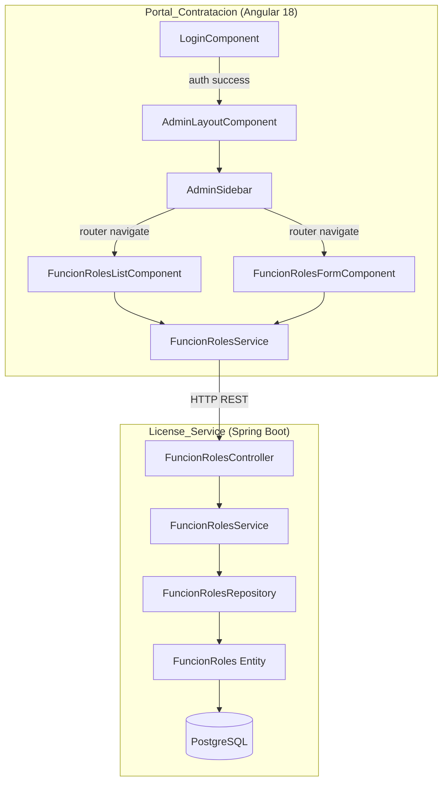
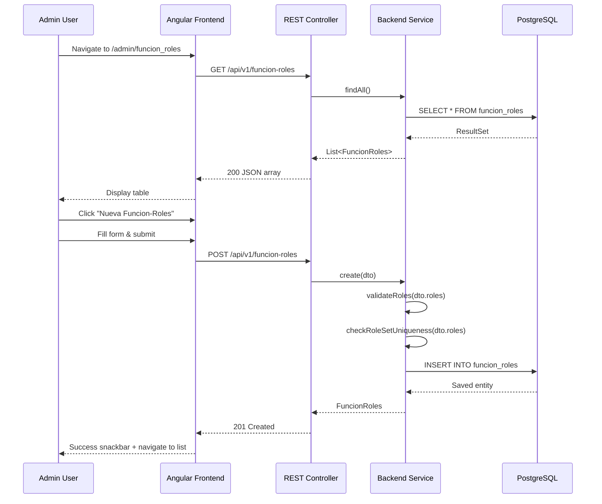

# Design Document: Funcion-Roles

## Overview

This design covers the implementation of a full CRUD module for managing "funcion-roles" relationships in the CRM admin platform. The feature spans two codebases:

- **Backend (License_Service):** A Java Spring Boot REST API with JPA/PostgreSQL persistence, including validation logic for role set uniqueness and membership in a fixed role vocabulary.
- **Frontend (Portal_Contratacion):** An Angular 18 application with Angular Material components, featuring a list page, create/edit form, and integration into a new admin sidebar layout.

The module allows platform administrators to define named groupings of roles (from a fixed set: tecnico, asistente, manager, admin, superusuario) and associate them with a "funcionalidad" (feature capability). Each grouping has a unique `codigo` identifier and a unique combination of roles.

### Key Design Decisions

| Decision | Rationale |
|----------|-----------|
| Roles stored as JSON array in a single column | Simplifies queries and aligns with existing Plan entity pattern; the role set is small and fixed |
| Order-independent comparison via sorted normalization | Comparing `Set<String>` semantics by sorting before storage/comparison ensures deterministic uniqueness checks |
| `codigo` as the business key for REST paths | Follows the existing Plan API pattern (`/api/v1/plans/{codigo}`) for consistency |
| Standalone Angular components with lazy loading | Matches existing plan module pattern; reduces bundle size |
| `permitAll` security on funcion-roles endpoints | Same as plans — internal admin tool, no gateway auth required |

## Architecture



### Request Flow



## Components and Interfaces

### Backend Components

#### FuncionRoles Entity (JPA)

```java
@Entity
@Table(name = "funcion_roles")
public class FuncionRoles {
    @Id
    @GeneratedValue(strategy = GenerationType.UUID)
    private UUID id;

    @Column(unique = true, nullable = false)
    private String codigo;

    @Column(columnDefinition = "TEXT")
    private String descripcion;

    @Column(nullable = false)
    private String funcionalidad;

    @Column(nullable = false, columnDefinition = "TEXT")
    @Convert(converter = RolesJsonConverter.class)
    private List<String> roles;

    @Column(name = "created_at", updatable = false)
    private LocalDateTime createdAt;

    @Column(name = "updated_at")
    private LocalDateTime updatedAt;

    @PrePersist
    protected void onCreate() {
        createdAt = LocalDateTime.now();
        updatedAt = LocalDateTime.now();
    }

    @PreUpdate
    protected void onUpdate() {
        updatedAt = LocalDateTime.now();
    }
}
```

#### RolesJsonConverter (JPA AttributeConverter)

```java
@Converter
public class RolesJsonConverter implements AttributeConverter<List<String>, String> {
    private static final ObjectMapper mapper = new ObjectMapper();

    @Override
    public String convertToDatabaseColumn(List<String> roles) {
        // Sort before storage for deterministic comparison
        List<String> sorted = new ArrayList<>(roles);
        Collections.sort(sorted);
        return mapper.writeValueAsString(sorted);
    }

    @Override
    public List<String> convertToEntityAttribute(String dbData) {
        return mapper.readValue(dbData, new TypeReference<List<String>>() {});
    }
}
```

#### FuncionRolesController (REST)

| Method | Path | Request Body | Response | Status |
|--------|------|-------------|----------|--------|
| GET | `/api/v1/funcion-roles` | — | `List<FuncionRolesDTO>` | 200 |
| GET | `/api/v1/funcion-roles/{codigo}` | — | `FuncionRolesDTO` | 200 / 404 |
| POST | `/api/v1/funcion-roles` | `CreateFuncionRolesRequest` | `FuncionRolesDTO` | 201 / 400 / 409 |
| PUT | `/api/v1/funcion-roles/{codigo}` | `UpdateFuncionRolesRequest` | `FuncionRolesDTO` | 200 / 400 / 404 / 409 |
| DELETE | `/api/v1/funcion-roles/{codigo}` | — | — | 204 / 404 |

#### FuncionRolesService (Backend)

Key responsibilities:
- **validateRoles(roles):** Verifies all roles are in `Valid_Roles_Set` and the list is non-empty
- **checkRoleSetUniqueness(roles, excludeCodigo?):** Normalizes role set (sort), queries all existing records, compares normalized sets, excludes the entity being updated if applicable
- **create(dto):** Validates, checks uniqueness, persists
- **update(codigo, dto):** Validates, checks uniqueness (excluding self), updates
- **delete(codigo):** Finds by codigo, deletes or throws 404

#### Validation Logic (Core)

```java
public class RoleSetValidator {
    public static final Set<String> VALID_ROLES = Set.of(
        "tecnico", "asistente", "manager", "admin", "superusuario"
    );

    public static boolean areRoleSetsEqual(List<String> a, List<String> b) {
        Set<String> setA = new TreeSet<>(a);
        Set<String> setB = new TreeSet<>(b);
        return setA.equals(setB);
    }

    public static boolean allRolesValid(List<String> roles) {
        return roles.stream().allMatch(VALID_ROLES::contains);
    }

    public static boolean isNonEmpty(List<String> roles) {
        return roles != null && !roles.isEmpty();
    }
}
```

### Frontend Components

#### FuncionRolesService (Angular)

```typescript
@Injectable({ providedIn: 'root' })
export class FuncionRolesService {
  private readonly http = inject(HttpClient);
  private readonly baseUrl = `${environment.apiUrl}/api/v1/funcion-roles`;

  getAll(): Observable<FuncionRoles[]>;
  getByCode(codigo: string): Observable<FuncionRoles>;
  create(request: CreateFuncionRolesRequest): Observable<FuncionRoles>;
  update(codigo: string, request: UpdateFuncionRolesRequest): Observable<FuncionRoles>;
  delete(codigo: string): Observable<void>;
}
```

#### FuncionRolesListComponent

- Standalone component with Angular Material table
- Columns: Codigo, Descripcion, Funcionalidad, Roles (chips), Acciones (edit/delete)
- "Nueva Funcion-Roles" button navigating to `/admin/funcion_roles/nuevo`
- Delete with confirmation dialog + error snackbar on failure

#### FuncionRolesFormComponent

- Dual-mode (create/edit) determined by URL context (presence of `:codigo` param)
- Fields: codigo (disabled in edit), descripcion, funcionalidad, role checkboxes
- Validation: at least one role must be selected
- 409 error handling: displays duplicate codigo or duplicate role set message
- Cancel navigates back without saving
- Network error preserves form state

#### AdminLayoutComponent

- Two-panel layout: left sidebar + right content area (router-outlet)
- Header with "Administrador de CRM" title and logout button
- Sidebar links: "Planes" → `/admin/planes`, "Funcion-Roles" → `/admin/funcion_roles`
- Active module highlighting via `routerLinkActive`

## Data Models

### Database Schema

```sql
CREATE TABLE funcion_roles (
    id UUID PRIMARY KEY DEFAULT gen_random_uuid(),
    codigo VARCHAR(100) UNIQUE NOT NULL,
    descripcion TEXT,
    funcionalidad VARCHAR(255) NOT NULL,
    roles TEXT NOT NULL,  -- JSON array string, e.g. '["admin","tecnico"]'
    created_at TIMESTAMP DEFAULT CURRENT_TIMESTAMP,
    updated_at TIMESTAMP DEFAULT CURRENT_TIMESTAMP
);
```

### DTOs

#### CreateFuncionRolesRequest

```java
public record CreateFuncionRolesRequest(
    @NotBlank String codigo,
    String descripcion,
    @NotBlank String funcionalidad,
    @NotEmpty List<String> roles
) {}
```

#### UpdateFuncionRolesRequest

```java
public record UpdateFuncionRolesRequest(
    String descripcion,
    @NotBlank String funcionalidad,
    @NotEmpty List<String> roles
) {}
```

#### FuncionRolesDTO (Response)

```java
public record FuncionRolesDTO(
    UUID id,
    String codigo,
    String descripcion,
    String funcionalidad,
    List<String> roles,
    LocalDateTime createdAt,
    LocalDateTime updatedAt
) {}
```

### Frontend TypeScript Interfaces

```typescript
export interface FuncionRoles {
  id: string;
  codigo: string;
  descripcion: string;
  funcionalidad: string;
  roles: string[];
  createdAt: string;
  updatedAt: string;
}

export interface CreateFuncionRolesRequest {
  codigo: string;
  descripcion: string;
  funcionalidad: string;
  roles: string[];
}

export interface UpdateFuncionRolesRequest {
  descripcion: string;
  funcionalidad: string;
  roles: string[];
}
```

## Correctness Properties

*A property is a characteristic or behavior that should hold true across all valid executions of a system — essentially, a formal statement about what the system should do. Properties serve as the bridge between human-readable specifications and machine-verifiable correctness guarantees.*

### Property 1: Roles JSON serialization round-trip

*For any* valid list of roles (subset of Valid_Roles_Set), serializing the list to a JSON string and then deserializing it back SHALL produce a list containing the exact same elements.

**Validates: Requirements 1.3**

### Property 2: Order-independent role set equality

*For any* two lists of roles that are permutations of each other (same elements, different order), the role set comparison function SHALL return true (equal). Conversely, for any two lists that differ in at least one element, the comparison SHALL return false (not equal).

**Validates: Requirements 3.3, 4.3, 11.1**

### Property 3: Invalid roles are always rejected

*For any* string that is not a member of Valid_Roles_Set (tecnico, asistente, manager, admin, superusuario), a roles list containing that string SHALL fail validation, regardless of what other valid roles are in the list.

**Validates: Requirements 3.5, 4.5**

### Property 4: Uniqueness check self-exclusion on update

*For any* existing funcion-roles entity, when updating that entity with its own current role set (unchanged), the uniqueness validation SHALL pass (not report a conflict with itself).

**Validates: Requirements 4.3, 11.2**

## Error Handling

### Backend Error Responses

All error responses follow a consistent JSON structure:

```json
{
  "error": "DESCRIPTIVE_ERROR_CODE",
  "message": "Human-readable error message",
  "conflictingCodigo": "FUNC_XXX"  // Only on 409 when retrieval succeeds
}
```

| Scenario | HTTP Status | Error Code |
|----------|-------------|------------|
| Entity not found by codigo | 404 | `NOT_FOUND` |
| Duplicate codigo | 409 | `DUPLICATE_CODIGO` |
| Duplicate role set | 409 | `DUPLICATE_ROLE_SET` |
| Empty roles array | 400 | `EMPTY_ROLES` |
| Invalid role in array | 400 | `INVALID_ROLE` |
| Missing required field | 400 | `VALIDATION_ERROR` |

### Frontend Error Handling

| Error Type | User Feedback | Form State |
|------------|--------------|------------|
| 400 (validation) | Snackbar with specific validation message | Preserved |
| 404 (not found) | Snackbar "Recurso no encontrado" | Navigate to list |
| 409 (duplicate codigo) | Snackbar "Ya existe una relación con ese código" | Preserved |
| 409 (duplicate role set) | Snackbar "Ya existe una relación con ese conjunto de roles: {codigo}" | Preserved |
| Network error | Snackbar "Error de conectividad" | Preserved |
| Router navigation failure | Error feedback in list; fallback allows page reload | N/A |

## Testing Strategy

### Unit Tests (Example-Based)

**Backend:**
- Controller endpoint tests with MockMvc (verify HTTP status codes, response bodies)
- Service layer tests with mocked repository (verify business logic flow)
- Edge cases: empty roles, non-existent codigo, duplicate codigo

**Frontend:**
- Component tests with Angular TestBed (verify rendering, user interactions)
- Service tests with HttpClientTestingModule (verify API calls, error handling)
- Form validation tests (verify disabled fields, required roles, cancel behavior)

### Property-Based Tests (fast-check)

The backend validation logic (`RoleSetValidator`) and the JSON converter (`RolesJsonConverter`) contain pure functions with clear input/output behavior suitable for property-based testing.

**Library:** fast-check (already in devDependencies)
**Minimum iterations:** 100 per property

Each property test is tagged with:
- **Feature: funcion-roles, Property {N}: {property_text}**

| Property | What is generated | What is verified |
|----------|------------------|-----------------|
| 1: Round-trip | Random subsets of Valid_Roles_Set | `deserialize(serialize(roles)) === roles` (as sets) |
| 2: Set equality | Random permutations of role lists | `areEqual(permute(roles), roles) === true` |
| 3: Invalid rejection | Random strings ∉ Valid_Roles_Set mixed with valid roles | `allRolesValid(list) === false` |
| 4: Self-exclusion | Existing entity with its own roles | `checkUniqueness(entity.roles, entity.codigo) === pass` |

### Integration Tests

- Full CRUD flow: create → read → update → read → delete → verify 404
- Security: verify all endpoints accessible without auth token
- Database: verify JSON column stores sorted array string

### Smoke Tests

- Database table exists with correct schema
- JPA entity loads without errors
- Routes registered and guarded correctly
- Login page renders with "Administrador de CRM" title
